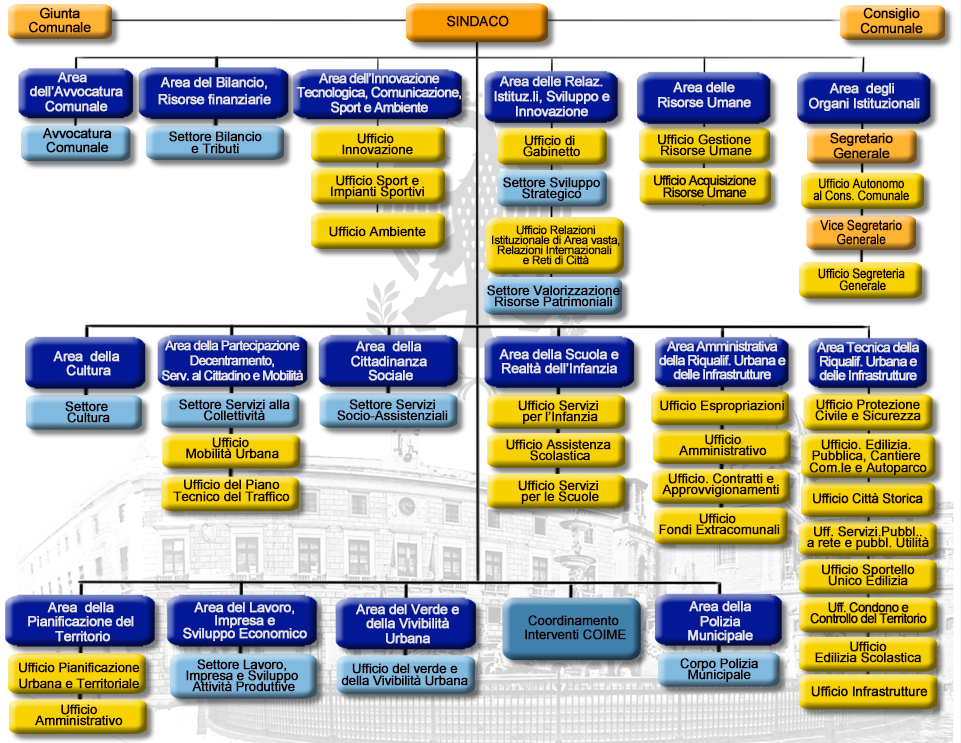
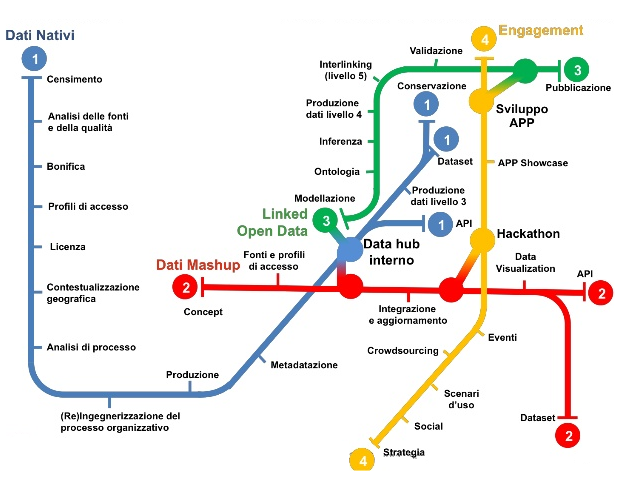
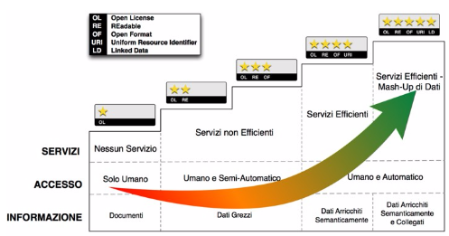
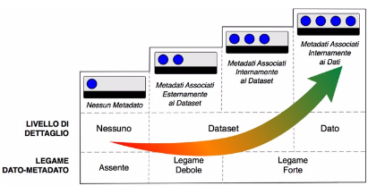

**Aggiornamento delle Linee Guida per le attività sugli Open Data della
Città di Palermo**

(versione “2017 partecipata”)

Le presenti Linee Guida, derivate dalla versione approvata con
Deliberazione di G.M. n. 252 del 13.12.2013, sono state integrate con le
novità apportate dalle [*Linee guida nazionali open data dell’AgID
versione 2016*](http://www.dati.gov.it/sites/default/files/LG2016_0.pdf)
e con il [*Profilo dei metadati
DCAT\_AP\_IT*](http://www.dati.gov.it/content/dcat-ap-it-v10-profilo-italiano-dcat-ap-0)
(AgID).

Il presente documento è stato arricchito, altresì, con la partecipazione
volontaria online (dal 25 gennaio 2017 al 13 aprile 2017) di soggetti
interessati alla politica di apertura del patrimonio informativo
comunale di Palermo, al fine di realizzare un testo strutturato in
materia di organizzazione interna necessaria all’apertura dei dati
dell’Amministrazione Comunale ed alla relativa pubblicazione e
divulgazione.

{width="0.9166666666666666in"
height="0.3229166666666667in"} Quest'opera è distribuita con Licenza CC
BY SA 4.0 - [*Creative Commons Attribuzione - Condividi allo stesso modo
4.0 Internazionale*](http://creativecommons.org/licenses/by-sa/4.0/).

**Indice**

INTRODUZIONE E PRINCIPI
=======================

Funzione delle Linee Guida
--------------------------

Il Comune di Palermo, in continuità ai contenuti delle Linee Guida
comunali open data approvate con Deliberazione di G.M. n. 252 del
13.12.2013, intende implementare la propria organizzazione con
riferimento ai criteri di trasparenza ed efficienza che devono permeare
l’azione amministrativa, così come richiesto dalla normativa
Comunitaria, Nazionale e Regionale.

Le **Linee Guida**, di cui al presente documento, costituiscono il
paradigma operativo adottato dal Comune al fine di realizzare nel
proprio ordinamento istituzionale i principi di trasparenza, efficienza,
responsabilizzazione della Pubblica Amministrazione e partecipazione
attiva della cittadinanza alle attività ed alla vita del Comune.

**Funzione delle presenti Linee Guida**, pertanto, è quella di:

1.  Dichiarare i principi ed i criteri informatori adottati dal Comune
    > di Palermo in materia di dati aperti;

2.  Descrivere procedure, modalità e tempi di adeguamento adottati dalle
    > strutture del Comune di Palermo al fine della raccolta,
    > catalogazione e pubblicazione dei dati posseduti
    > dall’amministrazione comunale secondo formati “*standard aperti*”,
    > così come previsto nel documento della Commissione
    > Europea:“[**European Interoperabilty
    > Framework**](https://ec.europa.eu/isa2/eif_en)”.

Preliminarmente appare opportuno fornire alcune **definizioni**
esemplificatrici dei principi ispiratori dell’azione di governo
Comunale.

Con il termine “**Governo Aperto**” (Open Government) si intende
(secondo la [*definizione data
dall’OCSE*](http://www.oecd.org/gov/46560184.pdf) - Organizzazione per
la Cooperazione e lo Sviluppo Economico): "*la trasparenza delle azioni
di governo, l'accessibilità dei servizi e delle informazioni pubbliche e
la capacità di risposta del governo alle nuove idee, alle esigenze ed
alle necessità*".

Con il termine “**Amministrazione Digitale**” (E-Government) si intende
(secondo la definizione data dalla Banca Mondiale): “*L'uso da parte di
agenzie governative di tecnologie informatiche che hanno la capacità di
trasformare le relazioni con i cittadini, con le imprese e con altri
rami di governo. Queste tecnologie possono servire una moltitudine di
scopi differenti: una migliore erogazione dei servizi pubblici per i
cittadini, interazioni fra le imprese e l'industria,
responsabilizzazione dei cittadini attraverso l'accesso alle
informazioni, o una più efficiente gestione dell’attività governativa. I
vantaggi che ne derivano possono essere individuati in una minore
corruzione, una maggiore trasparenza, maggiori vantaggi ed opportunità,
crescita dei ricavi e/o di riduzione dei costi*".

Con il termine “**Dato Aperto**” (o Dati Aperti, Open Data) si intende
(secondo la [*definizione data nel progetto Open Definition della Open
Knowledge Foundation*](http://opendefinition.org/)): “*un contenuto o un
dato si definisce aperto se chiunque è in grado di utilizzarlo,
ri-utilizzarlo e ridistribuirlo, soggetto, al massimo, alla richiesta di
attribuzione e condivisione allo stesso modo*”.

Il Codice dell’Amministrazione Digitale (D.L. 82/2005 e successive
modifiche ed integrazioni) contiene indicazioni e caratteristiche dei
“Dati aperti”.

Con il termine “**Standard Aperto**” si intende quello standard
disponibile pubblicamente con diversi diritti ad esso associati, e con
diverse proprietà con cui è stato progettato (secondo la [*definizione
riportata su
it.wikipedia.org*](https://it.wikipedia.org/wiki/Standard_aperto)).

Uno standard si considera “aperto” quando ([*secondo le prescrizioni
fornite dall'Unione Europea nel documento European Interoperability
Framework
-EIF-*](http://ec.europa.eu/idabc/en/document/2319/5644.html)):

-   *è adottato e mantenuto da un’organizzazione non-profit ed il cui
    > sviluppo avviene sulle basi di un processo decisionale aperto e a
    > disposizione di tutti gli interlocutori interessati e le cui
    > decisioni vengono prese per consenso o a maggioranza;*

-   *il documento di specifiche è disponibile liberamente oppure ad un
    > costo nominale. Deve essere possibile farne copie, riusarle e
    > distribuirle liberamente senza alcun costo aggiuntivo;*

-   *eventuali diritti di copyright, brevetti o marchi registrati sono
    > irrevocabilmente concessi sotto forma di royalty-free;*

-   *non è presente alcun vincolo al riuso, alla modifica e
    > all’estensione dello standard.*

Le superiori definizioni consentono di esplicitare, sin da adesso, i
principi informatori delle presenti Linee Guida quali **la
valorizzazione del patrimonio informativo pubblico inteso come strumento
di trasparenza dell’attività amministrativa ed elemento imprescindibile
per l'innovazione e lo sviluppo economico e sociale del territorio**.

Ulteriori definizioni concernenti la terminologia maggiormente diffusa
nell’ambito dei dati aperti viene riportata in Appendice “A”.

**Le Linee Guida adottate dal Comune di Palermo, pertanto, hanno lo
scopo di:**

1.  descrivere l’organizzazione adottata dal Comune all'interno delle
    > proprie strutture al fine della pubblicazione e aggiornamento dei
    > dati;

2.  disciplinare criteri e modalità di individuazione di dati e di
    > documenti all'interno delle strutture comunali che possono essere
    > oggetto di pubblicazione e riutilizzo;

3.  regolamentare modalità di gestione e di aggiornamento dei dati;

4.  descrivere le licenze adottate dal Comune al fine di consentire il
    > riutilizzo dei dati e dei documenti di cui l'amministrazione è
    > titolare, o di cui abbia disponibilità;

5.  disciplinare le richieste civiche di modifica/integrazione dei dati
    > pubblicati e le modalità di inserimento dei nuovi dati.

Le presenti Linee Guida hanno validità 24 mesi dalla loro approvazione e
si intendono automaticamente rinnovate in assenza di un eventuale
aggiornamento

Governo Aperto e dati aperti come strumenti di trasparenza
-----------------------------------------------------------

Il Comune di Palermo individua nel paradigma dell’Open Government una
via per creare una P.A. aperta e che dia vigore all’innovazione nei
confronti di cittadini ed imprese: gli Open Data rappresentano uno dei
capisaldi di tale strategia.

Il principio fondamentale degli Open Data è che i dati pubblici, nel
rispetto della normativa vigente, appartengono alla collettività e come
tali devono essere ri-utilizzabili da chiunque ne abbia interesse.

Attraverso la pubblicazione degli Open Data il Comune di Palermo
valorizza il proprio patrimonio informativo e:

-   favorirà la democrazia partecipativa rendendo i cittadini
    > maggiormente consapevoli della realtà in cui vivono e consentendo
    > loro di effettuare scelte che soddisfino i bisogni della
    > collettività;

<!-- -->

-   agevolerà la raggiungibilità dei dati tramite un motore di ricerca,
    > rendendo disponibili una elevata quantità di dati che di solito
    > sono difficilmente reperibili;

<!-- -->

-   farà da volano per lo sviluppo dell'economia permettendo alle
    > imprese e ai singoli di creare nuove applicazioni di interesse per
    > la collettività

    1.  Open Data
        ---------

(tratto dal documento del Formez “[*Open Data Come rendere aperti i dati
delle pubbliche
amministrazioni*](http://trasparenza.formez.it/sites/all/files/VademecumOpenData_0.pdf)”)

Una P.A. che voglia dare realtà concreta all’*Open Government* deve
prioritariamente mettere a disposizione del cittadino e delle imprese i
dati pubblici in un formato aperto (Open Data).

Distribuire i dati pubblici in un formato aperto e libero da restrizioni
sia dal punto di vista dell’accesso che dell’integrazione e del
riutilizzo, rappresenta il presupposto di base affinché possa
svilupparsi un vero e proprio processo di collaborazione tra le
istituzioni e la comunità dei cittadini sulle scelte di governo, anche
attraverso la rielaborazione in forma nuova e diversa dei dati messi a
disposizione.

Mediante strategie di apertura dei dati pubblici, i cittadini non sono
più soltanto consumatori passivi di informazioni messe a disposizione
dalle amministrazioni. Hanno invece l’opportunità di riutilizzare e
integrare i dati messi loro a disposizione, fino a sviluppare servizi e
applicazioni a vantaggio dell’intera comunità di utenti, che vanno ad
affiancarsi a quelli creati centralmente dalle istituzioni.

I dati per considerarsi aperti in base agli standard internazionali
(secondo Transparency International Georgia, Ten Open Data Guidelines
[*http://transparency.ge/en/ten-open-data-guidelines)*](http://transparency.ge/en/ten-open-data-guidelines)
devono essere:

-   **Completi**. I dati devono comprendere tutte le
    > componenti (metadati) che consentano di esportarli, utilizzarli on
    > line e off line, integrarli e aggregarli con altre risorse e
    > diffonderli in rete.

-   **Primari**. Le risorse digitali devono essere strutturate in modo
    > tale che i dati siano presentati in maniera sufficientemente
    > granulare, così che possano essere utilizzate dagli utenti per
    > integrarle e aggregarle con altri dati e contenuti in formato
    > digitale;

-   **Tempestivi**. Gli utenti devono essere messi in condizione di
    > accedere e utilizzare i dati presenti in rete in modo rapido e
    > immediato, massimizzando il valore e l’utilità derivanti da
    > accesso e uso di queste risorse;

-   **Accessibili**. I dati devono essere resi disponibili al maggior
    > numero possibile di utenti senza barriere all’utilizzo, quindi
    > preferibilmente attraverso il solo protocollo Hypertext Transfer
    > Protocol (HTTP) e senza il ricorso a piattaforme proprietarie.
    > Devono essere inoltre resi disponibili senza alcuna sottoscrizione
    > di contratto, pagamento, registrazione o richiesta.

-   **Leggibili da computer**. Per garantire agli utenti la piena
    > libertà di accesso e soprattutto di utilizzo e integrazione dei
    > contenuti digitali, è necessario che i dati siano processabili in
    > automatico dal computer.

-   **In formati non proprietari**. I dati devono essere codificati in
    > formati aperti e pubblici, sui quali non vi siano entità (aziende
    > o organizzazioni) che ne abbiano il controllo esclusivo. Sono
    > preferibili i formati con le codifiche più semplici e
    > maggiormente supportati.

-   **Liberi da licenze che ne limitino l’uso**. I dati aperti devono
    > essere caratterizzati da licenze che non ne limitino l’uso, la
    > diffusione o la redistribuzione.

-   **Riutilizzabili**. Affinché i dati siano effettivamente aperti, gli
    > utenti devono essere messi in condizione di riutilizzarli e
    > integrarli, fino a creare nuove risorse, applicazioni e servizi di
    > pubblica utilità.

-   **Ricercabili**. I dati devono essere facilmente identificabili in
    > rete, grazie a cataloghi e archivi facilmente indicizzabili dai
    > motori di ricerca.

-   **Permanenti**. Le peculiarità fino ad ora descritte devono
    > caratterizzare i dati nel corso del loro intero ciclo di vita.

    1.  Normativa di riferimento
        ------------------------

Le presenti linee guida per la normativa di settore fanno riferimento al
paragrafo “Normativa di Riferimento” delle [*Linee Guida Nazionali per
la Valorizzazione del Patrimonio Informativo Pubblico (2° semestre
2016)*](http://www.dati.gov.it/sites/default/files/LG2016_0.pdf)[.](http://www.agid.gov.it/sites/default/files/linee_guida/linee-guida-patrimonio-informativo-pubblico-iisem2013.pdf)

Di seguito, a titolo esemplificativo e non esaustivo, verrà indicata la
normativa, a livello Nazionale, Comunitario, nonché gli accordi
internazionali cui l’Italia aderisce, che norma e disciplina le regole
poste a garanzia della massima trasparenza dell’operato della P.A. ed i
criteri volti a favorire la pubblicazione dei dati detenuti dalle stesse
Pubbliche Amministrazioni.

1.  **Normativa Italiana**

**Decreto Legislativo n. 82 del 7.03.2005 e ss.mm.ii., e Decreto
Legislativo n. 235 del 30.12.2010**: Codice dell'Amministrazione
Digitale (CAD)

Art. 52: “.*..Le pubbliche amministrazioni, al fine di valorizzare e
rendere fruibili i dati pubblici di cui sono titolari, promuovono
progetti di elaborazione e di diffusione degli stessi anche attraverso
l'uso di strumenti di finanza di progetto, assicurando...la
pubblicazione dei dati e dei documenti in formati aperti...*”

Art. 68: “..*.Le pubbliche amministrazioni nella predisposizione o
nell'acquisizione dei programmi informatici, adottano soluzioni
informatiche...che assicurino l'interoperabilità e la cooperazione
applicativa e consentano la rappresentazione dei dati e documenti in più
formati, di cui almeno uno di tipo aperto...*”

**Decreto Legislativo n. 36 del 24.01.2006**: Attuazione della direttiva
2003/98/CE relativa al riutilizzo di documenti nel settore pubblico.

Il Decreto Legislativo in parola (art. 1) disciplina le modalità di
riutilizzo dei documenti contenenti dati pubblici nella disponibilità
delle pubbliche amministrazioni e degli organismi di diritto pubblico.

**Decreto Legge n. 83 del 22.06.2012** (Sviluppo 2.0)

Art. 18 (Amministrazione aperta): “*La concessione delle sovvenzioni,
contributi, sussidi ed ausili finanziari alle imprese e l'attribuzione
dei corrispettivi e dei compensi a persone, professionisti, imprese ed
enti privati e comunque di vantaggi economici di qualunque genere di cui
all'articolo 12 della legge 7 agosto 1990, n. 241 ad enti pubblici e
privati, sono soggetti alla pubblicita' sulla rete internet, ai sensi
del presente articolo e secondo il principio di accessibilita' totale di
cui all'articolo 11 del decreto legislativo 27 ottobre 2009”*

**Decreto Legge n. 179 del 18.10.2012** (Crescita 2.0) coordinato con la
**Legge di conversione n. 221 del 17.12.2012**

Art. 9 (modifica Art. 52 CAD): *“Le pubbliche amministrazioni pubblicano
nel proprio sito web, all'interno della sezione "Trasparenza,
valutazione e merito", il catalogo dei dati, dei metadati e delle
relative banche dati in loro possesso ed i regolamenti che ne
disciplinano l'esercizio della facoltà di accesso telematico e il
riutilizzo, fatti salvi i dati presenti in Anagrafe tributaria.*

*I dati e i documenti che le amministrazioni titolari pubblicano, con
qualsiasi modalità, senza l'espressa adozione di una licenza di cui
all'articolo 2, comma 1, lettera h), del decreto legislativo 24 gennaio
2006, n. 36, si intendono rilasciati come dati di tipo aperto ai sensi
all'articolo 68, comma 3, del presente Codice.”*

[***Legge n. 190 del
6.11.2012***](http://www.normattiva.it/uri-res/N2Ls?urn:nir:stato:legge:2012-11-06;190),
Disposizioni per la prevenzione e la repressione della corruzione e
dell'illegalità nella Pubblica Amministrazione.

Art. 1 comma 4 lett d): “*Il Dipartimento della funzione pubblica, anche
secondo linee di indirizzo adottate dal Comitato interministeriale
istituito e disciplinato con decreto del Presidente del Consiglio dei
Ministri:(...) definisce modelli standard delle informazioni e dei dati
occorrenti per il conseguimento degli obiettivi previsti dalla presente
legge, secondo modalità che consentano la loro gestione ed analisi
informatizzata*”;

Art. 1 comma 32, obbligo di pubblicazione dei dati di appalto dell’Ente
appaltante;

Art. 1 comma 35, obblighi di pubblicità, trasparenza e diffusione di
informazioni da parte delle pubbliche amministrazioni, ivi compreso
l’obbligo di pubblicazione dei dati relativi ai titolari di incarichi
politici (lett. c); definizione dei modelli standard delle informazioni
e dei dati occorrenti per il conseguimento degli obiettivi previsti
dalla presente legge, secondo modalità che consentano la loro gestione
ed analisi informatizzata (lett. d);

[***Il Decreto trasparenza, D.Lgs.
33/2013***](http://www.normattiva.it/atto/caricaDettaglioAtto?atto.dataPubblicazioneGazzetta=2013-04-05&atto.codiceRedazionale=13G00076&currentPage=1),
Riordino della disciplina riguardante gli obblighi di pubblicità,
trasparenza e diffusione di informazioni da parte delle pubbliche
amministrazioni.

Art. 3 Pubblicita' e diritto alla conoscibilità: “*Tutti i documenti, le
informazioni e i dati oggetto di pubblicazione obbligatoria ai sensi
della normativa vigente sono pubblici e chiunque ha diritto di
conoscerli, di fruirne gratuitamente, e di utilizzarli e riutilizzarli
ai sensi dell'articolo 7”*.

Art. 7 Dati aperti e riutilizzo: “*I documenti, le informazioni e i dati
oggetto di pubblicazione obbligatoria ai sensi della normativa vigente,
resi disponibili anche a seguito dell'accesso civico di cui all'articolo
5, sono pubblicati in formato di tipo aperto ai sensi dell'articolo 68
del Codice dell'amministrazione digitale, di cui al decreto legislativo
7 marzo 2005, n. 82, e sono riutilizzabili ai sensi del decreto
legislativo 24 gennaio 2006, n. 36, del decreto legislativo 7 marzo
2005, n. 82, e del decreto legislativo 30 giugno 2003, n. 196, senza
ulteriori restrizioni diverse dall'obbligo di citare la fonte e di
rispettarne l'integrità*”.

[***Linee Guida Nazionali per la Valorizzazione del Patrimonio
Informativo Pubblico (2° semestre
2016)***](http://www.agid.gov.it/sites/default/files/linee_guida/linee-guida-patrimonio-informativo-pubblico-iisem2013.pdf)

Destinatari: *“Il presente documento è destinato a tutte le
Amministrazioni, così come definite all’art. 2 comma 2 del CAD, che a
esso si uniformano (art. 9 DL n. 179/2012)”.*

1.  **Normativa Europea**

[***Direttiva 2003/98/CE del Parlamento Europeo e del Consiglio del
17.11.2003***](http://eur-lex.europa.eu/LexUriServ/LexUriServ.do?uri=OJ:L:2003:345:0090:0096:IT:PDF)

Art. 3 - Principio Generale: *“Gli Stati membri provvedono affinché, ove
sia permesso il riutilizzo di documenti in possesso degli enti pubblici,
questi documenti siano riutilizzabili a fini commerciali o non
commerciali conformemente alle condizioni indicate nei capi III e IV. I
documenti sono resi disponibili, ove possibile, per via elettronica”.*

[***Direttiva 2013/37/UE del Parlamento Europeo e del consiglio del
26.06.2013***](http://eur-lex.europa.eu/LexUriServ/LexUriServ.do?uri=OJ:L:2013:175:0001:0008:IT:PDF)

La Superiore Direttiva del Parlamento e del Consiglio Europeo modifica
la direttiva 2003/98/CE relativa al riutilizzo dell’informazione del
settore pubblico.

Art. 5 è sostituito dal seguente: “*Articolo 5 Formati disponibili 1.
Gli enti pubblici mettono a disposizione i propri documenti in qualsiasi
formato o lingua preesistente e, ove possibile e opportuno, in formati
aperti leggibili meccanicamente e insieme ai rispettivi metadati. Sia il
formato che i metadati dovrebbero, nella misura del possibile, essere
conformi a standard formali aperti*”.

1.  **Normativa Internazionale
    cui aderisce lo Stato Italiano**

[***La Carta dei dati aperti del
G8***](http://www.dati.gov.it/content/l%E2%80%99open-data-charter-tradotta-italiano)
([*Open Data
Charter*](https://www.gov.uk/government/publications/open-data-charter))

La Carta dei Dati aperti costituisce una dichiarazione di intenti e di
principi cui gli Stati sottoscrittori intendono aderire. Sebbene le
dichiarazioni espresse non abbiano valore di norma cogente, i relativi
principi rappresentano una importante affermazione di valori espressa
dal Primo Principio che recita: “*Riconosciamo che l’accesso gratuito ai
dati aperti, ed i loro successivo ri-uso, sono di grande valore per la
società e l’economia*”.

[***3° Piano Azione nazionale Open Government
Partnership***](http://open.gov.it/terzo-piano-dazione-nazionale/)

E’ un’**iniziativa internazionale** che mira a ottenere impegni concreti
dai Governi in termini di promozione della **trasparenza**, di sostegno
alla **partecipazione civica**, di **lotta alla corruzione** e di
diffusione, dentro e fuori le Pubbliche Amministrazioni, di nuove
tecnologie a sostegno dell’**innovazione**.

1.  ORGANIZZAZIONE DEL COMUNE PER LE ATTIVITÀ SUGLI OPEN DATA
    =========================================================

    1.  Strutturazione interna
        ----------------------

Il [*Comune di Palermo*](http://www.comune.palermo.it/), al mese di
Aprile 2017, è strutturato amministrativamente nelle Aree rappresentate
di seguito:

{width="6.6930555555555555in"
height="5.180555555555555in"}

Al fine di costruire un "modello operativo efficiente" per la produzione
e gestione del dato pubblico di tipo aperto è auspicabile individuare,
all’interno dell’amministrazione, delle figure strategiche per una
corretta implementazione dello stesso.

A tal uopo, le [*LINEE GUIDA NAZIONALI PER LA VALORIZZAZIONE DEL
PATRIMONIO INFORMATIVO
PUBBLICO*](http://www.dati.gov.it/sites/default/files/LG2016_0.pdf),
pubblicate nel dicembre 2016 dall'Agenzia per l'Italia Digitale,
prevedono, al paragrafo “ruoli e responsabilità” l'individuazione di
figure chiare all'interno dell'ente pubblico che deve mettere in moto il
processo di pubblicazione e gestione degli Open Data. Di seguito si
riportano tali figure:

-   ***Team Open Data**. E’ il gruppo che promuove l’uso e la diffusione
    > degli Open Data. Riporta all’interno dell’amministrazione le
    > novità inerenti il mondo dell’Open Government, media e valuta le
    > esigenze di pubblicazione dati relative alla normativa sulla
    > trasparenza, e ne cura la razionalizzazione rispetto agli altri
    > processi di apertura del dato. Ha la responsabilità di pianificare
    > e coordinare l’evoluzione continua dell’apertura dei dati
    > nell’amministrazione, nonché dell’infrastruttura IT a supporto.
    > Inoltre, si può occupare della formazione tecnica e concettuale
    > all’interno dell’amministrazione riguardo i temi del paradigma
    > Open Data, anche sulla base delle linee guida pubblicate
    > dall’Agenzia per l’Italia Digitale e sullo stato dell’arte degli
    > Open Data dell’amministrazione. Alcuni membri del team (e.g.,
    > esperti di tecnologie Web, esperti GIS, esperti di tecnologie e
    > strumenti per i Linked Data) possono occuparsi della gestione del
    > processo di apertura del dato dal punto di vista IT.*

-   ***Responsabile Open Data** (o **Data Manager**). All’interno del
    > team Open Data viene nominato un responsabile. Pianifica la
    > strategia di apertura dei dati raccolti e analizzati e le attività
    > di diffusione dei dati. Collabora con il responsabile della
    > trasparenza (quest’ultimo istituito ai sensi del Dlgs. n.33/2013)
    > fornendo le indicazioni sulle risorse informative a disposizione
    > dell’amministrazione, la qualità della loro interoperabilità, le
    > indicazioni tecnico-operative per il rilascio dei dati della
    > trasparenza in formato Open Data e l’eventuale riscontro in merito
    > a possibili difficoltà nel reperimento i dati.*

-   ***Titolare della banca dati**. E’ colui che all’interno
    > dell’amministrazione è responsabile del procedimento
    > amministrativo che popola la specifica fonte del dato, che ne cura
    > la qualità e il relativo aggiornamento. E’ tipicamente un
    > Dirigente o un Quadro che coordina un gruppo di persone che
    > svolgono il loro lavoro quotidiano attorno alla fonte del dato
    > in esame.*

-   ***Referente tecnico della banca dati**. Si tratta tipicamente di un
    > componente del gruppo coordinato dal Titolare della banca dati;
    > esso ha conoscenze informatiche almeno di base e svolge un ruolo
    > operativo sul sistema gestionale afferente al dato.*

-   ***Referente tematico della banca dati**. Si tratta di un esperto di
    > dominio che conosce in modo approfondito l’ufficio e la storia dei
    > dati su cui l’ufficio opera. Spesso propone nuovi dataset da
    > esporre a partire dal sistema gestionale corrispondente e cura
    > eventuali valutazioni di dominio o relative al significato
    > dei dati. Ha anche la possibilità di compiere bonifiche e semplici
    > adeguamenti sulla banca dati, su segnalazione di cittadini o su
    > valutazioni proprie. Riferisce invece al Titolare della Banca dati
    > la necessità di eventuali variazioni strutturali al sistema
    > gestionale che insiste sui dati.*

-   ***Ufficio Statistica**, **Uffici giuridici** e **Uffici per la
    > comunicazione***, *che di solito sono già presenti
    > nell'organizzazione di un ente pubblico di medie e grandi
    > dimensioni, hanno anche un ruolo nella produzione, archivio,
    > gestione e pubblicazione degli Open Data*.

Tali figure sono già state individuate nell’organico del Comune di
Palermo a seguito dell’approvazione delle linee guida comunali avvenute
con deliberazione di GM n.252 del 13.12.2013.

La struttura dello staff comunale sugli Open Data, con i relativi
recapiti pubblici, verrà pubblicata sulla pagina web relativa agli Open
Data.

Modello Operativo
-----------------

Le linee guida nazionali per la valorizzazione del patrimonio
informativo pubblico mostrano un possibile modello operativo riportato
nella figura seguente. Il modello illustra le principali tappe (fasi)
del processo di produzione e gestione dei dati aperti da parte di una
Pubblica Amministrazione.

{width="6.050694444444445in"
height="4.674305555555556in"}

*In particolare, il modello consiste di tre linee di produzione: “dati
nativi” che riguarda la produzione di dati nativi attraverso
un’organizzazione e razionalizzazione dell’esistente, “dati mashup” che
riguarda invece lo sviluppo di dataset complessi, prodotti a sostegno di
processi comunicativi, sociali o economici, e “Linked Open Data” che
riguarda la produzione di dati aperti di tipo Linked (livelli 4 e 5) e
che, come tendenza generale, è da adottare per tutti i dati pubblici che
dovranno essere resi disponibili.*

*A queste tre linee si aggiunge quella “ortogonale” dell’”engagement”.
La cultura dei dati aperti deve essere sostenuta e sviluppata nel
rapporto con i cittadini e il mondo delle imprese. Se è vero che gli
Open Data costituiscono un potente motore di sviluppo economico e di
coinvolgimento attivo della popolazione, è altrettanto vero che occorre
individuare le forme e gli strumenti attraverso i quali tali processi
possano effettivamente attivarsi. Per questo è necessaria una specifica
filiera di attività che condivida il lavoro delle amministrazioni con
tutti i possibili “stakeholder”*.

Il Comune di Palermo, nell’organizzazione delle sue attività sugli Open
Data, rifacendosi a tale modello operativo, ha portato prevalentemente
avanti azioni relative a produzione di dati nativi, strategia di
engagement interno e civico attraverso: attività di
[*formazione*](https://sites.google.com/view/opendataformazione),
webinar del FormezPA, hackathon, eventi (open data day), visualizzazione
dati. Nell’ottica del miglioramento del processo di pubblicazione dei
dataset l’Amministrazione si pone l’obiettivo di generare linked open
data.

Formazione
----------

L'Amministrazione comunale si continua a concentrare, altresì,
nell'organizzazione di percorsi formativi annuali affinché i dipendenti
che operano quotidianamente con dati, siano messi nelle condizioni di
apprendere le procedure idonee per la produzione e pubblicazione di Open
Data. Nei cicli formativi è auspicabile prevedere, tra le figure
tutoriali, anche quella degli sviluppatori, cioè quelle figure
professionali che utilizzeranno i dati rilasciati dalle Pubbliche
Amministrazioni principalmente per la creazione di applicazioni
innovative e servizi utili sia alla Pubblica Amministrazione che alla
collettività.

Il Responsabile Open Data si attiverà per l'attivazione di percorsi
formativi periodici.

Il Team Open Data provvede, con il coordinamento dello staff del
Responsabile open data, tramite azioni di sensibilizzazione, ad
aumentare la consapevolezza sull’utilità dell’Open Data all’interno dei
singoli uffici comunali, condizione *sine qua non* per consentire
all’intera struttura istituzionale di mettere a regime l'attività di
produzione e pubblicazione degli Open Data, per meglio rispondere ai
recenti obblighi normativi e alle esigenze di trasparenza
amministrativa.

Partecipazione sociale nel processo degli Open Data comunali
------------------------------------------------------------

Affinché il Comune di Palermo possa essere supportato operativamente
nell'attività di gestione e pubblicazione degli Open Data si prevede la
possibilità per soggetti esterni, esperti a vario titolo della materia,
di collaborare gratuitamente con il personale degli Uffici. La comunità
di sviluppatori locali di applicazioni e le comunità attive sugli open
data (ad esempio [*opendatasicilia*](http://opendatasicilia.it/)) e
sulla cultura digitale rappresentano, a titolo esemplificativo, squadre
competenti che possono aiutare la struttura comunale nelle attività
interne volte a *standardizzare* il processo produttivo dei dati.

L'Amministrazione, al fine di permettere il coinvolgimento propositivo
di soggetti esterni con competenza in materia nei processi di
implementazione della politica di open data, prevede la possibilità di
partecipazione di dette figure in occasione delle riunioni periodiche
del Team open data. A tal uopo l'Amministrazione provvede a dare
tempestiva comunicazione delle riunioni periodiche attraverso comunicati
stampa, specificando le modalità di partecipazione alle quali si devono
attenere le figure interessate.

Attività di monitoraggio e ruolo degli indicatori
-------------------------------------------------

Un sistema di monitoraggio dell’attuazione di quanto previsto dalle
presenti linee guida, da effettuarsi anche attraverso il supporto
operativo di volontari rappresentanti della cittadinanza, permette di
verificare costantemente l'andamento della politica di Open Data
dell'Amministrazione Comunale, e di apportare le eventuali manovre
correttive ove fosse ritenuto necessario per un continuo miglioramento.

La collaborazione esterna del gruppo di volontari nelle attività di
monitoraggio della politica Open Data rappresenta una sorta di check up
- dall'esterno - sulle attività comunali implementate in detta materia.
Questi verranno selezionati tramite un avviso pubblico, rivolto a coloro
che fossero interessati a collaborare a titolo gratuito con
l'Amministrazione su questo tema.

Il sistema di monitoraggio si effettua attraverso l'uso di semplici
indicatori, capaci di misurare le performance dell'Ente Pubblico nella
politica di pubblicazione degli open data. Gli indicatori prescelti
permettono di comprendere importanza e ruolo degli Open Data nel
territorio locale sia al fine di migliorare l'usabilità dei servizi
pubblici erogati dai vari Settori, che per generare anche opportunità di
sviluppo economico derivanti dalla creazione di applicazioni innovative
che si nutrono degli Open Data comunali.

Il monitoraggio si effettua sia all'interno della struttura delle Aree
Comunali, verificando l'operatività dei singoli dirigenti d'Area per la
pubblicazione degli Open Data nel portale web (frequenza di
pubblicazione, tipologia di dati pubblicati più frequentemente), sia
all'esterno verificando gli andamenti di download dei dati e delle
richieste pervenute dalla cittadinanza (quali dati vengono per lo più
richiesti). Il monitoraggio include anche la verifica di tutte quelle
nuove applicazioni eventualmente generate da sviluppatori grazie alla
pubblicazione di Open Data comunali e che hanno un'utilità per la
collettività nonchè per l'Amministrazione Pubblica stessa.

Per facilitare il monitoraggio sulle attività di pubblicazione degli
Open Data del Comune, si prevede di effettuare delle riunioni
periodiche, con cadenza semestrale, del personale interno
dell'Amministrazione Comunale individuato nel Team Open Data. Le
riunioni possono essere svolte presso una delle sedi
dell'Amministrazione comunale, da concordare preventivamente,
utilizzando per le comunicazioni necessarie la posta elettronica.

Ogni riunione prevede l’individuazione di un segretario
(dell'Amministrazione Comunale) che verbalizzerà gli argomenti discussi,
producendo un documento condiviso da tutti i presenti che verrà,
successivamente, pubblicato sul portale open data.

Gli indicatori utilizzati per il monitoraggio della politica comunale
sugli Open Data sono almeno i seguenti:

A.  numero di set di dati pubblicati ogni anno da un’Area Comunale,

B.  frequenza di aggiornamento di un dataset da parte di un’Area
    > Comunale,

C.  descrizione della tipologia di dati afferenti un argomento/tema
    > pubblicati più frequentemente durante un semestre (ad es. vengono
    > pubblicati più dati su "mobilità urbana" rispetto al "sociale" o
    > rispetto alla cultura, ..),

D.  numero di download dei vari file Open Data pubblicati sul portale
    > web e percentuale di download per ogni dataset pubblicato con
    > indicazione dell'argomento di riferimento del file Open Data (es.:
    > mobilità - cultura - …) nel periodo di un semestre,

E.  descrizione della tipologia di dati maggiormente richiesti dalla
    > cittadinanza/aziende via email e pubblicati in un semestre,

F.  numero di set di Open Data pubblicati a seguito di richiesta da
    > parte della cittadinanza/aziende,

G.  numero di applicazioni generate dagli sviluppatori derivanti dalla
    > pubblicazione di uno specifico dataset,

H.  descrizione delle principali criticità sorte nel periodo di un
    > semestre nell'attività di pubblicazione degli Open Data comunali.

A seguito delle riunioni semestrali per le attività di monitoraggio
della politica comunale di Open Data, il Team open data
dell'Amministrazione Comunale si impegna, con l'eventuale supporto del
gruppo di volontari, a produrre un report contenente i dati desunti
dalle stesse attività di monitoraggio attraverso l'uso degli indicatori.

Il report verrà pubblicato in formato aperto nella piattaforma online
del Comune sugli Open Data.

Piattaforma web per la pubblicazione degli open data del Comune di Palermo
---------------------------------------------------------------------------

Strumento attuativo della politica di riutilizzo comunale, di
trasparenza e pubblicità dei dati e documenti oggetto di riuso è la
piattaforma Open Data
([*www.comune.palermo.it/opend*](http://www.comune.palermo.it/opendata.php)[*ata*](http://www.google.com/url?q=http%3A%2F%2Fwww.comune.palermo.it%2Fopendata.php&sa=D&sntz=1&usg=AFQjCNGb-R3zM1ZI35fhOw6s4JRXT4d4oA)[*.php*](http://www.comune.palermo.it/opendata.php)),
dove vengono pubblicati i dati pubblici in formato aperto che il Comune
di Palermo individua.

Nel corso della [*riunione del Team Open Data del 21 dicembre
2016*](https://www.comune.palermo.it/js/server/uploads/opendata/verbale_riunione_team_open_data_Comune_Palermo_21_dic_2016.pdf)
è stato condivisa l’innovazione dell’attuale portale web. Attualmente
sono in corso attività di progettazione e realizzazione del nuovo
portale che sarà reso disponibile all’indirizzo
[*https://opendata.comune.palermo.it*](https://opendata.comune.palermo.it/).

La piattaforma Open Data è accessibile attraverso l'area pubblica, agli
utenti web interessati al riutilizzo di dati e documenti pubblici. La
piattaforma consente la ricerca e il *download* dei dati e dei documenti
messi a disposizione ai fini del loro riutilizzo attraverso la
pubblicazione sulla piattaforma stessa.

Da questa piattaforma è possibile sfogliare i dati per categoria e
leggerne le informazioni correlate (i metadati). I dataset sono
associati a una relativa licenza standard, così come previsto dalle
linee guida nazionali per la valorizzazione del patrimonio informativo
pubblico redatte dall’AgID (versione 2016, paragrafo “aspetti legali e
di costo”).

Il dato e/o il documento riutilizzabile è pubblicato sulla piattaforma
accompagnato anche dalla relativa scheda dei metadati.

Allo stato attuale la piattaforma Open Data include un motore di ricerca
interno specializzato e dovrà evolvere in modo da includere:

-   una pagina con degli esempi di riuso e applicazioni sviluppate a
    > partire dai dati pubblicati dal Comune

-   link attivi sulle parole chiave usate per classificare i dataset, in
    > modo da aprire una pagina con gli altri dataset caratterizzati
    > dalla stessa parola chiave.

1.  

    PROCESSO DI PUBBLICAZIONE DEGLI OPEN DATA
    =========================================

    1.  Metodologia per la pubblicazione dei dati in formato open
        ---------------------------------------------------------

La metodologia per la pubblicazione dei dati in formato Open Data fa
riferimento al modello operativo discusso precedentemente e si pone
l’obiettivo di pianificare le azioni da intraprendere per raggiungere la
pubblicazione dei dati a 5 stelle, secondo la classificazione presentata
in Appendice B. Questo obiettivo si raggiungerà per passi individuando
un primo sotto-obiettivo nella pubblicazione dei dati a 3 stelle, per
poi passare gradualmente alle 5 stelle. Ovviamente affinché il processo
sia efficiente occorre progettarlo tenendo in considerazione fin
dall’inizio l’obiettivo finale della pubblicazione dei dati a 5 stelle.

Ad oggi la maggior parte dei dataset sono pubblicati con formato
catalogabile a 3 stelle.

La metodologia proposta si basa sulle metodologie descritte nelle “Linee
Guida per l'Interoperabilità Semantica attraverso i Linked Open Data”
pubblicate dall'agenzia per l'Italia Digitale e nel documento di
Villazón-Terrazas “Methodological guidelines for publishing linked
data”. Entrambi i documenti individuano azioni specifiche che occorre
intraprendere affinché i dati della pubblica amministrazione possano
essere pubblicati come Linked Open Data.

L’approccio che verrà seguito riprende al suo interno le fasi previste
dalle metodologie citate, ma differisce da queste in quanto si prevede
una *milestone* intermedia relativa alla pubblicazione dei dati in
formato a 3 stelle, per consentire una prima valorizzazione dei dati
pubblicati attraverso la realizzazione di applicazioni specifiche. Nelle
fasi successive verranno intraprese le azioni necessarie per la
pubblicazione dei dati in formato Linked Open Data. Il seguente elenco
mostra i passi dell’approccio proposto:

1.  individuazione e selezione dei dataset negli uffici

2.  bonifica dei dataset ove si ritenga necessario per il rispetto dei
    > requisiti minimi per la pubblicazione

3.  arricchimento tramite metadati ai sensi dello standard DCAT\_AP\_IT
    > 2016

4.  validazione e pubblicazione (dati almeno 3 stelle)

5.  analisi e modellazione

6.  linking con dataset esterni

7.  validazione e pubblicazione (dati a 4 e 5 stelle)

Modalità di individuazione (e selezione) dei dati da pubblicare in formato open
-------------------------------------------------------------------------------

Saranno oggetto di pubblicazione in formato aperto, tendenzialmente,
tutti i dati e i documenti contenenti dati che il Comune di Palermo ha
acquisito o prodotto nell’ambito dell’esercizio delle proprie funzioni
istituzionali e di cui il medesimo è titolare, o di cui è nella piena
disponibilità anche tenendo conto (ma non limitatamente) della normativa
vigente in tema di pubblicazione di dati in formato aperto e del
rispetto della privacy degli individui.

A tale proposito viene effettuato, attraverso i Dirigenti e/o i
referenti open data di Settore, Servizio o Unità Organizzativa, un
censimento delle raccolte di dati create dalle strutture comunali in
funzione delle competenze specifiche e delle attività relative.

A ogni Dirigente e alla Società comunale dei servizi informatici SISPI
SpA viene chiesto di compilare una scheda, anche online, per ogni
raccolta di dati che ne individui la tipologia, il formato, il livello
di privacy, l’ubicazione, la data di creazione, la data dell’ultimo
aggiornamento, ecc. (vedi scheda in Appendice C).

Il team Open Data, durante le riunioni periodiche, esamina le raccolte
di dati e ne individua la priorità di pubblicazione (in funzione della
pubblica utilità, ecc.).

Nel primo periodo di attuazione dei contenuti delle Linee Guida comunali
open data approvate con Deliberazione di Giunta Municipale n. 252 del
13.2.2013, per avviare il processo di pubblicazione dei dataset
comunali, è stata seguita la procedura del metodo[*MoSCoW*](http://en.m.wikipedia.org/wiki/MoSCoW_Method)
di seguito schematizzato.

  ----------------------------------------------------------------------------------------------------------------------------------------------------------------------------------------------------------------------------------------
  **Priorità**   **Descrizione**                                                                                                                                   **Fattori identificativi**
  -------------- ------------------------------------------------------------------------------------------------------------------------------------------------- -----------------------------------------------------------------------
  M - MUST       Indica un dataset che ha la massima priorità di pubblicazione affinché il servizio Open Data possa essere considerato un caso di successo.        Ampio interesse per il dataset da parte della collettività\
                                                                                                                                                                   Best Practice in altre PA

  S - SHOULD     Indica un dataset ad alta priorità che, se possibile, dovrebbe essere incluso nella lista di pubblicazione attuale.                               Medio interesse per il dataset da parte della collettività

                                                                                                                                                                   Pubblicato da altre PA

  C - COULD      Indica un dataset che si ritiene di auspicabile pubblicazione ma non necessario. Questo sarà incluso se il tempo e le risorse lo consentiranno.   Ridotto interesse per il dataset da parte della collettività

                                                                                                                                                                   Pubblicato da qualche PA

  W - WON’T      Indica un dataset che che non sarà inserito nella lista di pubblicazione attuale, ma che può essere considerato per il futuro.                    Non si riscontra interesse per il dataset da parte della collettività

                                                                                                                                                                   Non sono stati pubblicati dataset simili in altre PA
  ----------------------------------------------------------------------------------------------------------------------------------------------------------------------------------------------------------------------------------------

Tale metodo è stato usato dal Team Open Data nelle riunioni periodiche e
aperte al pubblico dal dicembre 2015 al dicembre 2016 per
l’individuazione dei dataset tematici da pubblicare.

Con cadenza annuale ogni Dirigente provvederà, se necessario,
all’aggiornamento dell’elenco delle raccolte di dati di sua competenza.

L’attività di individuazione dei dati oggetto di pubblicazione in
formato aperto dovrà essere, in ogni caso, condotta in modo tale da
escludere quelli che, per il tipo di riutilizzo o per le modalità con
cui si intende realizzarlo, potrebbero violare:

-   la sicurezza pubblica, la difesa nazionale, lo svolgimento di
    > indagini penali o disciplinari;

-   il diritto di terzi al segreto industriale, statistico e
    > commerciale, o altri vincoli di segretezza fissati in obblighi di
    > legge;

-   i diritti di proprietà intellettuale;

-   il diritto alla protezione dei dati personali.

In ogni caso, per assicurare la trasparenza amministrativa garantendo,
al contempo, la protezione dei dati personali o coperti da segreto, il
Comune procederà, quando necessario, alla pubblicazione di dati
aggregati o resi anonimi in modo da non consentire alcuna
identificazione, nemmeno indiretta, dei soggetti a cui tali dati si
riferiscono, coerentemente con la normativa vigente in materia.

Modalità di produzione dei dataset e formato di pubblicazione
-------------------------------------------------------------

(in parte da “[*Allegato B - Formati aperti e metadati per il riutilizzo
e la diffusione dei dati
pubblici*](http://www.innovazione.provincia.tn.it/binary/pat_innovazione/notizie/AllegatoB_formati_21Dicembre_def.1356705197.pdf)”
della Provincia di Trento)

Il Comune di Palermo metterà a disposizione i dati pubblici, ove
possibile, in modalità elettronica e nei seguenti formati aperti che
favoriscano l'interoperabilità:

  --------------------------------------------------------------------------------------------------------------------------------------------------------------------------------------------------------------------------------------------------------------------------------------------------------------------------------------------------------------------
  **Nome (Acronimo)**                                                                                                                                                                                                                                                                                    **Tipo di Dato**     **Estensione del file**

  **Descrizione**                                                                                                                                                                                                                                                                                                             
  ------------------------------------------------------------------------------------------------------------------------------------------------------------------------------------------------------------------------------------------------------------------------------------------------------ -------------------- ----------------------------------------
  ***Comma Separated Value (CSV)***                                                                                                                                                                                                                                                                      *Dato tabellare*     *.csv*

  *Formato testuale per l'interscambio di tabelle, le cui righe corrispondono a record e i cui valori delle singole colonne sono separati da una virgola (o punto e virgola)*                                                                                                                                                 

  ***Geographic Markup Language (GML)***                                                                                                                                                                                                                                                                 *Dato geografico*    *.gml*

  *Formato XML utile allo scambio di dati territoriali di tipo vettoriale*                                                                                                                                                                                                                               *vettoriale*         

  **GeoJSON**                                                                                                                                                                                                                                                                                            Dato geografico      Di solito .geojson, .topojson, o .json

  E’ un formato di testo aperto, per la codifica di oggetti geografici e dei correlati attributi non spaziali, scritto in JSON (JavaScript Object Notation).                                                                                                                                             vettoriale           

  ***Keyhole Markup Language (KML)***                                                                                                                                                                                                                                                                    *Dato geografico*    *.kml*

  *Formato basato su XML creato per gestire dati territoriali in tre dimensioni.*                                                                                                                                                                                                                        *vettoriale*         

  ***Open Document Format per dati tabellari (ODS)***                                                                                                                                                                                                                                                    *Dato tabellare*     *.ods*

  *Formato per l'archiviazione e lo scambio di fogli di calcolo*                                                                                                                                                                                                                                                              

  ***Resource Description Framework (RDF)***                                                                                                                                                                                                                                                             *Dato strutturato*   *.rdf*

  *Basato su XML, e' lo strumento base proposto da World Wide Web Consortium (W3C) per la codifica, lo scambio e il riutilizzo di metadati strutturati e consente l'interoperabilità tra applicazioni che si scambiano informazioni sul Web*                                                                                  

  ***ESRI Shapefile (SHP)***                                                                                                                                                                                                                                                                             *Dato geografico*    *.shp, .shx, .dbf, .prj*

  *Lo Shapefile ESRI è un popolare formato vettoriale per sistemi informativi geografici. Il dato geografico viene distribuito normalmente attraverso tre o quattro files (se indicato il sistema di riferimento delle coordinate). Il formato è stato rilasciato da ESRI come formato (quasi) aperto*   *vettoriale*         

  ***Tab Separated Value (TSV)***                                                                                                                                                                                                                                                                        *Dato tabellare*     *.tsv*

  *Formato testuale per l'interscambio di tabelle, le cui righe corrispondono a record e i cui valori delle singole colonne sono separati da un carattere di tabulazione*                                                                                                                                                     

  ***Extensible Markup Language (XML)***                                                                                                                                                                                                                                                                 *Dato strutturato*   *.xml*

  *E' un formato di markup, ovvero basato su un meccanismo che consente di definire e controllare il significato degli elementi contenuti in un documento o in un testo attraverso delle etichette (markup)*                                                                                                                  
  --------------------------------------------------------------------------------------------------------------------------------------------------------------------------------------------------------------------------------------------------------------------------------------------------------------------------------------------------------------------

I dati saranno resi disponibili da ciascuna Area in un formato aperto
che li renda riutilizzabili direttamente da programmi di elaborazione di
calcolo da parte di una macchina (formato machine-readable) e, ove
possibile, in formato standard pubblici, leggibili e basati su
specifiche pubbliche ed esaustive tali da permetterne l'interpretazione
da parte di persone (formati human-readable). I dati saranno resi
disponibili accompagnati dai relativi metadati, salvo specifiche e
motivate eccezioni, indicate per ciascun dataset da ciascuna Area
nell’ambito dell’individuazione periodica dei dati che saranno
rilasciati in formato aperto, secondo quanto indicato al punto
precedente delle presenti Linee Guida.

Modalità di produzione dei dataset dalle piattaforme ICT del PON METRO 2014-2020: le API
-----------------------------------------------------------------------------------------

Il PON METRO Palermo è un programma di interventi che, tra gli altri,
prevede, dal 2017 al 2020, la realizzazione di 7 piattaforme digitali
tematiche che riguardano i seguenti ambiti: ambiente e territorio,
lavoro e formazione, tributi, edilizia e catasto, cultura e tempo
libero, assistenza e sostegno sociale, lavori pubblici. Al momento della
redazione delle presenti linee guida comunali open data,
l’Amministrazione comunale ha avviato la progettazione esecutiva
propedeutica alla realizzazione delle piattaforme ICT alle quali saranno
agganciati i processi amministrativi e i servizi degli uffici/aree
competenti.

Al fine di ottimizzare la generazione e pubblicazione dei dataset in
open data concernenti le tematiche delle piattaforme digitali del PON
METRO, e al fine di stimolarne il riuso, si ritiene valido strutturare
le stesse in maniera tale da ospitare, e quindi rendere disponibili, le
API (Application Programming Interface) per ogni tipologia di riuso
creativo, sia interno all’Amministrazione o esterno da parte della
società.

I Metadati con il profilo nazionale DCAT\_AP\_IT
------------------------------------------------

I dati aperti pubblicati attualmente dal Comune di Palermo utilizzano lo
schema di metadati definito nelle precedenti linee guida comunali.

In accordo con le linee guida nazionali per la valorizzazione del
patrimonio informativo pubblico è necessario recepire le indicazioni
relativo all'utilizzo del profilo nazionale
[*DCAT-AP\_IT*](http://www.dati.gov.it/content/dcat-ap-it-v10-profilo-italiano-dcat-ap-0).

Nel caso di dati geografici il profilo di metadatazione da adottare è
quello del [*Repertorio Nazionale dei Dati Territoriali
*](http://www.rndt.gov.it/RNDT/home/index.php?option=com_content&view=article&id=37&Itemid=190)
(RNDT), conforme alla [*direttiva
INSPIRE*](http://www.agid.gov.it/sites/default/files/leggi_decreti_direttive/01_direttiva_inspire_2007_2_ce.pdf).”

In aggiunta, l’insieme dei metadati del profilo DCAT-AP\_IT è stato
integrato con metadati aggiuntivi ritenuti rilevanti per migliorare il
riuso dei dati pubblicati, come già previsto dalle linee guida
nazionali: ”*Le pubbliche amministrazioni possono integrare i metadati
previsti dal modello DCAT-AP\_IT con metadati aggiuntivi, secondo le
proprie necessità seppur nel pieno rispetto delle regole di conformità
come definite nella specifica DCAT-AP\_IT*.

Questa sezione, non ha lo scopo di approfondire i dettagli tecnici della
specifica DCAT-AP\_IT, già ampiamente discussi nei documenti ufficiali,
ma si focalizza su due aspetti specifici che riguardano l’introduzione
della specifica DCAT-AP\_IT nel contesto della pubblicazione dei dati
aperti del comune di Palermo. Nello specifico in questa sezione verranno
presentate: a) le relazioni tra i metadati della specifica DCAT-AP\_IT e
lo schema di metadati adottato fino adesso, in accordo alla precedente
versione delle linee guida comunali, al fine di consentire l’adeguamento
dei metadati già pubblicati, al profilo nazionale della specifica
DCAT-AP\_IT; b) le integrazioni adottate dal comune di Palermo ai
metadati della specifica DCAT-AP\_IT.

La specifica DCAT-AP\_IT propone una struttura di metadati, basata sui
concetti principali di *Catalogo*, *Dataset* e *Distribuzione*. Il
*Catalogo* rappresenta un insieme di dataset, e pertanto i metadati
relativi ad esso riguardano le proprietà dell’intero insieme di dataset
(es. Organizzazione che pubblica i dati). Al *Catalogo* sono associati i
*Dataset* che lo compongono. A sua volta ogni *Dataset*, può avere a sé
associate diverse *Distribuzioni*, che si differenziano per il formato
usato per la pubblicazione dei dati, la licenza utilizzata, e così via.
Ogni *Distribuzione* prevede quindi metadati specifici per descrivere
queste proprietà.

Relativamente al catalogo, la versione attuale delle linee guida non
prevede dei metadati specifici per l’intero catalogo, pertanto per
rendere la pubblicazione dei dati conforme alle specifiche DCAT-AP\_IT i
metadati relativi al catalogo dovranno essere resi disponibili. La
seguente tabella riporta i metadati previsti dalla specifica DCAT-AP\_IT
per la descrizione del *Catalogo*.

**Metadati per la descrizione del Catalogo (dcatapit:Catalog)** (**\***
Obbligatorio)

  ---------------------------------------------------------------------------------------------------------------------------------------------------------------------------------------------------------------------------------------------------------------------------------------------------------------------------------
  **Metadato**                  **Proprietà DCAT-AP\_IT**   **Descrizione**
  ----------------------------- --------------------------- -----------------------------------------------------------------------------------------------------------------------------------------------------------------------------------------------------------------------------------------------------------------------

  titolo del catalogo **\***    dct:title (M)               Questa proprietà contiene un nome dato al Catalogo. Questa proprietà può essere ripetuta per esprimere il titolo in diverse lingue.

  descrizione catalogo **\***   dct:description (M)         Questa proprietà contiene una sintesi con un testo libero

                                                            delle caratteristiche del catalogo. Questa proprietà può essere ripetuta per esprimere la descrizione in diverse lingue.

  home page catalogo            foaf:homepage (R)           Questa proprietà si riferisce ad una pagina web che funge

                                                            da pagina principale per il Catalogo.

  lingua catalogo               dct:language (R)            Questa proprietà si riferisce a una lingua utilizzata nei metadati testuali che descrivono i titoli, le descrizioni, … dei Dataset nel Catalogo. Questa proprietà può essere ripetuta se i metadati sono forniti in più lingue. Deve essere utilizzato il vocabolario

                                                            [*http://publications.europa.eu/mdr/authority/language/*](http://publications.europa.eu/mdr/authority/language/)

  temi del catalogo             dcat:themeTaxonomy (R)      Questa proprietà si riferisce ad un sistema di organizzazione

                                                            della conoscenza (KOS) usato per classificare i dataset del

                                                            Catalogo. Il valore da utilizzare per questa proprietà è l’URI

                                                            del vocabolario stesso (non gli URI dei concetti presenti nel

                                                            vocabolario). Nel caso del vocabolario EU Data Theme da

                                                            utilizzare obbligatoriamente per indicare i temi relativi ai

                                                            Dataset, l’URI da indicare è il seguente:

                                                            [*http://publications.europa.eu/resource/authority/data-theme*](http://publications.europa.eu/resource/authority/data-theme)

  editore del catalogo **\***   dct:publisher (M)           Questa proprietà si riferisce ad un’entità (organizzazione)

                                                            responsabile a rendere disponibile il Catalogo.

  data rilascio catalogo        dct:issued (R)              Questa proprietà contiene la data del rilascio formale (es.

                                                            pubblicazione) del Catalogo.

  data ultima modifica          dct:modified (R)            Questa proprietà contiene la data più recente in cui il

  catalogo                                                  Catalogo è stato aggiornato.
  ---------------------------------------------------------------------------------------------------------------------------------------------------------------------------------------------------------------------------------------------------------------------------------------------------------------------------------

I metadati definiti nella precedente versione delle linee guida, e
attualmente in uso, trovano corrispondenze nelle proprietà degli
elementi *Dataset* e *Distribuzione* nello schema DCAT-AP\_IT. Le
seguenti tabelle riportano, i dati obbligatori per lo schema DCAT-AP\_IT
(indicati con M), quelli ritenuti obbligatori secondo lo schema proposto
da queste linee guida (asterisco **\*)**. Si fa presente che si è scelto
di mantenere obbligatori i metadati indicati come tali nella precedente
versione delle linee guida anche se lo schema DCAT-AP\_IT non lo
prevede.

Come nomi delle proprietà dei metadati si è scelto di adottare quello
proposto dallo schema DCAT-AP\_IT. Nelle seguenti tabelle viene
riportato in corsivo tra parentesi il nome corrispondente nello schema
di metadati adottato dalle precedenti linee guida.

**Metadati per la descrizione del Dataset (dcatapit:Dataset)** (**\***
Obbligatorio)

  ---------------------------------------------------------------------------------------------------------------------------------------------------------------------------------------------------------------------------------------------------------------------------------------------------------------------------------------------------------------------------------------------------------------------------------------------------------------------------------------------------------------------------------------------
  **Metadato**                            **Proprietà DCAT-AP\_IT**    **Descrizione**
  --------------------------------------- ---------------------------- ------------------------------------------------------------------------------------------------------------------------------------------------------------------------------------------------------------------------------------------------------------------------------------------------------------------------------------------------------------------------------------------------------------------------------------------------------------------------

  **Titolo\***                            dct:title (M)                Questa proprietà contiene un nome assegnato al Dataset.

                                                                       Questa proprietà può essere ripetuta per esprimere il titolo

                                                                       in diverse lingue

  **Descrizione \***                      dct:description (M)          Questa proprietà contiene una sintesi come testo libero delle

                                                                       caratteristiche del Dataset. Questa proprietà può essere

                                                                       ripetuta per esprimere la descrizione in diverse lingue.

  **punto di contatto**                   dcat:contactPoint (R)        Questa proprietà contiene informazioni di contatto che possono essere usate per inviare osservazioni e commenti sul Dataset.

  **(*Contatto*) \***                                                  

  **parole chiave del dataset**           dcat:keyword (R)             Questa proprietà contiene una parola chiave o un’etichetta

  **(*Tag/Parole chiave*) \***                                         che descrive il Dataset.

  **tema del dataset**                    dcat:theme (R)               Questa proprietà si riferisce alla categoria in cui è

  **(*Categorie*) \***                                                 classificato il Dataset. Un Dataset può essere associato a più

                                                                       temi. I valori da utilizzare per questa proprietà sono gli URI dei concetti del vocabolario EU Data Theme (URI vocabolario:

                                                                       [*http://publications.europa.eu/resource/authority/data-theme*](http://publications.europa.eu/resource/authority/data-theme) ) descritti alla pagina

                                                                       [*http://publications.europa.eu/mdr/authority/data-theme*](http://publications.europa.eu/mdr/authority/data-theme)

  **titolare del dataset**                dct:rightsHolder             Sulla base anche di quanto indicato all’art.2 lettera i) del D. Lgs. n. 36/2006, il titolare del dataset è la pubblica amministrazione o l’organismo di diritto pubblico che ha originariamente formato per uso proprio o commissionato ad altro soggetto pubblico o privato il documento che rappresenta il dato, o che ne ha la disponibilità. Il titolare è pertanto responsabile della gestione complessiva del dataset in virtù dei propri compiti istituzionali.

  **(*Assessorato titolare*) \***                                      Si fa presente che, nell’ambito della presente specifica, l’accezione di documento suddetta può essere intesa riferita al dataset.

  **frequenza di aggiornamento**          dct:accrualPeriodicity (O)   Questa proprietà si riferisce alla frequenza con cui il Dataset

  **(*aggiornamento*) \***                                             viene aggiornato. I valori da utilizzare per questa proprietà sono gli URI dei concetti del vocabolario MDR Frequency Named Authority List

                                                                       ([*http://publications.europa.eu/mdr/authority/frequency*](http://publications.europa.eu/mdr/authority/frequency)).

  **data di rilascio**                    dct:issued (O)               Questa proprietà contiene la data del rilascio formale (es.

  **(*Data di pubblicazione*) \***                                     pubblicazione) del Dataset.

  **data di ultima modifica**             dct:modified (O)             Questa proprietà contiene la data più recente in cui il Dataset è stato modificato o aggiornato

  **(*Data di aggiornamento*) \***                                     

  **autore del dataset**                  dct:creator                  Questa proprietà si riferisce a una o più entità (organizzazione) che hanno materialmente creato il Dataset. Nel caso in cui titolare e autore del dataset coincidano, allora si può omettere questa proprietà. (Le informazioni relative all’autore possono anche includere l’email o l’indirizzo dell’organizzazione)

  **(*Autore*)**                                                       

  **copertura Geografica**                dct:spatial (O)              Questa proprietà si riferisce a un’area geografica coperta dal Dataset. (Vanno specificati i metadati di Localizzazione

                                                                       (dct:Location) così come indicati nella specifica DCAT-PA\_IT)

  **estensione temporale**                dct:temporal (O)             Questa proprietà si riferisce a un periodo temporale coperto

                                                                       dal Dataset. (Vanno specificati: data iniziale e data finale)

  **Referente\***                                                      E’ il titolare del dataset, cioé il “titolare della banca dati” come definito sopra (nel paragrafo sulla strutturazione interna)

  **Dataset richiesto da un cittadino**                                Booleano si/no

  **Documentazione tecnica**                                           Indirizzo o indirizzi delle pagine web che contengono informazioni utili alla comprensione del contenuto del dataset

  **Altro**                                                            Ogni altra informazione utile per dataset
  ---------------------------------------------------------------------------------------------------------------------------------------------------------------------------------------------------------------------------------------------------------------------------------------------------------------------------------------------------------------------------------------------------------------------------------------------------------------------------------------------------------------------------------------------

**Metadati per la descrizione della Distribuzione
(dcatapit:Distribution) associata al Dataset**

(**\*** Obbligatorio)

  ----------------------------------------------------------------------------------------------------------------------------------------------------------------------------------------------------------
  **Metadato**                                          **Proprietà DCAT-AP\_IT**   **Descrizione**
  ----------------------------------------------------- --------------------------- ------------------------------------------------------------------------------------------------------------------------

  **URL di accesso \***                                 dcat:accessURL (M)          Questa proprietà contiene un URL tramite cui si può

  **(*URI permanente*)**                                                            accedere alla Distribuzione del Dataset.

  **Licenza \***                                        dct:license (R)             Questa proprietà si riferisce a una licenza con la quale la

                                                                                    Distribuzione è resa disponibile.

  **formato distribuzione**                             dct:format (R)              Questa proprietà si riferisce al formato del file della Distribuzione.

  **(*Formato*) \***                                                                I valori da utilizzare per questa proprietà sono gli URI dei

                                                                                    concetti del vocabolario MDR File Type Named Authority List

                                                                                    ([*http://publications.europa.eu/mdr/authority/file-type/*](http://publications.europa.eu/mdr/authority/file-type/) ).

                                                                                    Nel caso di file “nidificati” (i.e. file compressi), il formato da

                                                                                    indicare è quello originario e non quello della cartella compressa che contiene il file originario.

                                                                                    Per esempio, nel caso del file nomefile.ttl.bz2, il formato da indicare è .ttl e non .bz2.

  **lunghezza del file**                                dcat:byteSize (O)           Questa proprietà contiene la lunghezza della Distribuzione

  **/dimensione in byte**                                                           in byte.

  **(*Dimensione*)**                                                                

  **Codifica Caratteri**                                                            Codifica dei caratteri utilizzata (es. “latin-1”, “PC-850”)

  **Formato distribuzione richiesto da un cittadino**                               Booleano si/no
  ----------------------------------------------------------------------------------------------------------------------------------------------------------------------------------------------------------

L’introduzione del nuovo schema dei metadati non comporta sostanziali
modifiche allo schema di metadati fino adesso adottato. I principali
cambiamenti riguardano: a) i nomi delle proprietà; b) l’URL di accesso
ai dati che con l’adozione di DCAT-AP\_IT diviene obbligatorio (Poiché
l’URL di accesso è disponibile per tutti dati attualmente pubblicati,
questa modifica potrà essere applicata senza particolari problemi), c)
dal punto di vista implementativo i metadati dovranno essere resi
disponibili in maniera conforme a quanto specificato dal DCAT-AP\_IT.

Confrontando lo schema di metadati adottato dal comune di Palermo con la
specifica DCAT-AP\_IT si evidenzia che: tutte le proprietà obbligatorie
(M) e raccomandate (R) in DCAT-AP\_IT sono state indicate come
obbligatorie. Alcune proprietà (come frequenza di aggiornamento, data di
rilascio) sono state ritenute di notevole importanza e pertanto vengono
richieste come obbligatorie anche se in DCAT-AP\_IT sono opzionali.
Inoltre, sono state previste alcune integrazioni allo schema DCAT-AP\_IT
sia per i *Dataset* che per le *Distribuzioni*. Relativamente al
*Dataset* sono state integrate come opzionali le proprietà che
permettono di indicare se il dataset è stato richiesto da un cittadino,
se c’è una documentazione tecnica allegata, ed eventuali note. In
aggiunta, viene mantenuta come obbligatoria la proprietà Referente,
anche se essa non è presente in DCAT-AP\_IT. Per quanto riguarda la
*Distribuzione*, è stata integrata come opzionale la proprietà relativa
alla codifica dei caratteri, e anche in questo caso, si potrà indicare
tra i metadati se il formato di distribuzione è stato richiesto da un
cittadino.

Infine, una considerazione particolare va riportata per le licenze. La
specifica DCAT-AP\_IT, infatti, richiede ulteriori informazioni sui
metadati relativi alla licenza delle distribuzioni, come indicato nella
seguente tabella.

**Metadati per la descrizione della Licenza (dcatapit:LicenceDocument)**
(**\*** Obbligatorio)

  --------------------------------------------------------------------------------------------------------------------------------------------------------------------------------------------------------------------------------------------------------------------------------------------------------------------------------------------------------
  **Metadato**          **Proprietà DCAT-AP\_IT**   **Descrizione**
  --------------------- --------------------------- ------------------------------------------------------------------------------------------------------------------------------------------------------------------------------------------------------------------------------------------------------------------------------------------------------

  **tipo licenza \***   dct:type (R)                Questa proprietà si riferisce al tipo di licenza, per es. che

                                                    indica “pubblico dominio” o “richiesto pagamento diritti”.

                                                    I valori da utilizzare per questa proprietà sono gli URI dei

                                                    concetti del vocabolario “ADMS licence type vocabulary”

                                                    (http://purl.org/adms/licencetype/). L’elenco dei termini

                                                    del vocabolario indicato è incluso nella specifica ADMS.

  **identificativo**    dct:identifier              Questa proprietà contiene un identificativo della Licenza, per es. l’URI o altro identificativo univoco. Si raccomanda di utilizzare come valori per questa proprietà gli URI delle licenze del vocabolario raccomandato [*http://creativecommons.org/ns\#Work*](http://creativecommons.org/ns#Work)

  **nome**              foaf:name                   Questa proprietà contiene un nome assegnato alla Licenza.

                                                    Si raccomanda di fare riferimento al vocabolario indicato per la proprietà Identificativo.

  **versione**          owl:versionInfo             Questa proprietà contiene il numero della versione o

                                                    Altre indicazioni della versione della Licenza.
  --------------------------------------------------------------------------------------------------------------------------------------------------------------------------------------------------------------------------------------------------------------------------------------------------------------------------------------------------------

Modello di dati per i dati aperti
---------------------------------

([**http://www.dati.gov.it/sites/default/files/LG2016\_0.pdf**](http://www.dati.gov.it/sites/default/files/LG2016_0.pdf)
*Linee Guida Nazionali per la Valorizzazione del Patrimonio Informatvo
Pubblico Anno 2016*)

Si adotta il modello qualitativo per i dati aperti sul Web, noto come
modello a cinque stelle.

In particolare, si tende a seguire un percorso graduale verso la
produzione nativa di Linked Open Data – LOD (livello cinque stelle),
iniziando dal livello 3. Produzione e pubblicazione di dati aperti solo
di livello 1 e 2 non sono più ammessi: quest’ultimi devono essere
accompagnati da quelli che rispecchiano le caratteristiche dei livelli 3
e/o superiori (per esempio, rilasciare dati strutturati solo in excel
con licenza aperta non è ammesso; questi devono essere sempre affiancati
da dati strutturati in formato non proprietario).

{width="5.177083333333333in"
height="2.71875in"}

1 stella

  > I**nformazione**:   > Dati disponibili tramite una licenza aperta e inclusi in documenti leggibili e interpretabili solo grazie a un significativo intervento umano (e.g., PDF).
  --------------------- ---------------------------------------------------------------------------------------------------------------------------------------------------------------------
  > **Accesso**:        > Prevalentemente umano, necessario anche per dare un senso ai dati inclusi nei documenti.
  > **Servizi**:        Solo rilevanti interventi umani di estrazione ed elaborazione dei possibili dati consentono di sviluppare servizi con l’informazione disponibile in questo livello.

2 stelle

  > I**nformazione**:   > Dati disponibili in forma strutturata e con licenza aperta. Tuttavia, i formati sono proprietari (e.g., Excel) e un intervento umano è fortemente necessario per un’elaborazione dei dati.
  --------------------- ----------------------------------------------------------------------------------------------------------------------------------------------------------------------------------------------
  > **Accesso**:        I programmi possono elaborare i dati ma non sono in grado di interpretarli; pertanto è necessario un intervento umano al fine di scrivere programmi ad-hoc per il loro utilizzo.
  > **Servizi**:        > Servizi ad-hoc che devono incorporare i dati per consentire un accesso diretto via Web agli stessi.

3 stelle

  > I**nformazione**:   > Dati con caratteristiche del livello precedente ma in un formato non proprietario (e.g., CSV, JSON, geoJSON). I dati sono leggibili da un programma ma l'intervento umano è necessario per una qualche elaborazione degli stessi.
  --------------------- -------------------------------------------------------------------------------------------------------------------------------------------------------------------------------------------------------------------------------------
  > **Accesso**:        > I programmi possono elaborare i dati ma non sono in grado di interpretarli; pertanto è necessario un intervento umano al fine di scrivere programmi ad-hoc per il loro utilizzo.
  > **Servizi**:        > Servizi ad-hoc che devono incorporare i dati per consentire un accesso diretto via Web agli stessi.

4 stelle

  I**nformazione**:   > Dati con caratteristiche del livello precedente ma esposti usando standard W3C quali RDF e SPARQL I dati sono descritti semanticamente tramite metadati e ontologie.
  ------------------- ------------------------------------------------------------------------------------------------------------------------------------------------------------------------
  > **Accesso**:      > I programmi sono in grado di conoscere l'ontologia di riferimento e pertanto di elaborare i dati quasi senza ulteriori interventi umani.
  > **Servizi**:      > Servizi, anche per dispositivi mobili, che sfruttano accessi diretti a Web per reperire i dati di interesse.

5 stelle

  -----------------------------------------------------------------------------------------------------------------------------------------------------------------------------------------------------------------------------------------------------------------------------------------------------------------------------------------------------------------------------------------------------------------------------------------------------------------------------------------------------------------------------------------------------------------------------------------------------------------------------------------------------------------------------------------------------------------------------------------------------------------------------------------------------------------------------------------------------------------------------------------------------------------------------------------------------------------------------
  > I**nformazione**:   > Dati con caratteristiche del livello precedente ma collegati a quelli esposti da altre persone e organizzazioni (i.e., Linked Open Data\[1\]). I dati sono descritti semanticamente tramite metadati e ontologie. Essi seguono il paradigma RDF (si veda “Architettura dell’informazione del settore pubblico”), in cui alle “cose” (o entità) è assegnata un URI univoca sul Web. Conseguentemente tale URI può essere utilizzata per effettuare accessi diretti alle informazioni relative a quella entità. I dati sono detti “linked” per la possibilità di referenziarsi (i.e., “collegarsi”) tra loro. Nel referenziarsi, si usano relazioni (“link”) che hanno un preciso significato e spiegano il tipo di legame che intercorre tra le due entità coinvolte nel collegamento. I Linked (Open) Data sono quindi un metodo elegante ed efficace per risolvere problemi di identità e provenienza, semantica, integrazione e interoperabilità.
                        >
                        > *Triple RDF i cui URI non siano utilizzabili da un agente Web per recuperare le informazioni a essi associati, non possono essere considerati pienamente conformi al paradigma Linked Data.*
                        >
                        > Nei caso dei Linked Open Data l'intervento umano si può ridurre al minimo e talvolta addirittura eliminare.
  --------------------- -------------------------------------------------------------------------------------------------------------------------------------------------------------------------------------------------------------------------------------------------------------------------------------------------------------------------------------------------------------------------------------------------------------------------------------------------------------------------------------------------------------------------------------------------------------------------------------------------------------------------------------------------------------------------------------------------------------------------------------------------------------------------------------------------------------------------------------------------------------------------------------------------------------------------------------------------------
  > **Accesso**:        > I programmi sono in grado di conoscere l'ontologia di riferimento e pertanto di elaborare i dati quasi senza ulteriori interventi umani.

  > **Servizi**:        > Servizi, anche per dispositivi mobili, che sfruttano sia accessi diretti a Web sia l'informazione ulteriore catturata attraverso i “link” dei dati di interesse, facilitando il mashup di dati.
  -----------------------------------------------------------------------------------------------------------------------------------------------------------------------------------------------------------------------------------------------------------------------------------------------------------------------------------------------------------------------------------------------------------------------------------------------------------------------------------------------------------------------------------------------------------------------------------------------------------------------------------------------------------------------------------------------------------------------------------------------------------------------------------------------------------------------------------------------------------------------------------------------------------------------------------------------------------------------------

\[1\]

<https://www.ted.com/talks/tim_berners_lee_on_the_next_web?nolanguage=en%2C>,

<https://www.w3.org/DesignIssues/LinkedData.html>,

<http://linkeddatabook.com/editions/1.0/>

<http://linkeddata.org/home>

I livelli del modello per i metadati
------------------------------------

*(*[**http://www.dati.gov.it/sites/default/files/LG2016\_0.pdf**](http://www.dati.gov.it/sites/default/files/LG2016_0.pdf)
*Linee Guida Nazionali per la Valorizzazione del Patrimonio Informatvo
Pubblico Anno 2016)*

La metadatazione ricopre un ruolo essenziale laddove i dati sono esposti
a utenti terzi e a software. I metadati, infatti, consentono una
maggiore comprensione e rappresentano la chiave attraverso cui abilitare
più agevolmente la ricerca, la scoperta, l’accesso e quindi il riuso dei
dati stessi. A tale scopo, si adotta il modello per i metadati
rappresentato in Figura 3. Il modello si focalizza sugli aspetti
qualitativi dei metadati, è indipendente dal particolare schema proposto
e, in parte, anche dal formato fisico di rappresentazione. La
classificazione qualitativa dei metadati si fonda su due fattori
principali: legame tra dato-metadato e livello di dettaglio.

{width="4.28125in"
height="2.1666666666666665in"}

Modello a quattro livelli per i metadati

{width="0.7604166666666666in"
height="0.3333333333333333in"}

  > **Legame dato metadato**:   > Nessun legame in quanto i dati non sono accompagnati da un’opportuna metadatazione.
  ----------------------------- ---------------------------------------------------------------------------------------
  > **Livello di dettaglio**:   > Nessuno in quanto i metadati non sono presenti.

{width="0.8020833333333334in"
height="0.34375in"}

  **Legame dato metadato**:   Il legame è debole perché i dati sono accompagnati da metadati esterni, (e.g., inclusi nella pagina di download del dataset o in file separati).
  --------------------------- --------------------------------------------------------------------------------------------------------------------------------------------------
  **Livello di dettaglio**:   I metadati forniscono informazioni relativamente a un dataset, quindi sono informazioni condivise dall'insieme di dati interni a quel dataset.

{width="0.7604166666666666in"
height="0.3229166666666667in"}

  > **Legame dato metadato**:   > Il legame è forte perché i dati incorporano i metadati che li descrivono.
  ----------------------------- ---------------------------------------------------------------------------------------------------------------------------------------------
  > **Livello di dettaglio**:   > I metadati forniscono informazioni relative a un dataset, quindi sono informazioni condivise dall'insieme di dati interni a quel dataset.

{width="0.7916666666666666in"
height="0.3333333333333333in"}

  > **Legame dato metadato**:   > Il legame è forte perché i dati incorporano i metadati che li descrivono.
  ----------------------------- ----------------------------------------------------------------------------------------------------------------
  > **Livello di dettaglio**:   > I metadati forniscono informazioni relative al singolo dato, quindi col massimo grado di dettaglio possibile

1.  

    Licenza per il riutilizzo
    -------------------------

Per gli aspetti legati alle licenze da assegnare ad ogni dataset si fa
riferimento al paragrafo “Aspetti legali e di costo “ delle linee guida
nazionali per la valorizzazione del patrimonio informativo pubblico
(AgID 2016).

Sulla piattaforma predisposta per il rilascio dei dati saranno presenti
e facilmente identificabili le informazioni relative alle licenze
adottabili.

Frequenza di aggiornamento
--------------------------

Periodicamente, con cadenza almeno annuale stabilita e formalizzata dal
team Open Data in relazione alla tipologia di dati, i singoli Settori
provvederanno all'aggiornamento dei dati già disponibili e oggetto di
riutilizzo.

Deve essere previsto nella pagina del dataset la comparsa di un alert
nel caso la frequenza di aggiornamento non venga rispettata.

Modalità di pubblicazione dei dataset sul sito web
--------------------------------------------------

Le raccolte di dati verranno pubblicate secondo le priorità attribuite
dal team Open Data.

Le raccolte di dati vengono pubblicate nella sezione “Open Data” del
sito web del Comune di Palermo con i relativi metadati.

Le raccolte di dati sono pubblicate e attribuite a una o più delle
seguenti tematiche:

-   AMBIENTE

-   AMMINISTRAZIONE

-   CULTURA E TURISMO

-   DATI SUL TERRITORIO

-   ISTRUZIONE

-   MOBILITA' E SICUREZZA

-   OPERE PUBBLICHE

-   SANITA' E SOCIALE

-   URBANISTICA

-   ATTIVITA' ECONOMICHE

-   BILANCIO

-   ELEZIONI

Le tematiche possono essere riviste annualmente e aggiornate, se
necessario, dal team Open Data o dal Webmaster in ragione delle nuove
necessità sopraggiunte.

Comunicazione e promozione dei dataset pubblicati
-------------------------------------------------

Il Responsabile Open Data con il suo staff supporta, sul piano formativo
e tecnologico, i Settori/Uffici e le altre strutture comunali
nell'intero processo di formazione dei dati, in modo da garantirne la
coerenza con gli standard necessari alla loro piena fruibilità e
apertura.

Il Responsabile Open Data con il suo staff supporta iniziative private e
pubbliche (Incontri, Barcamp, Hackathons, Mappathon, Open Data day, ...)
volte alla comunicazione e promozione dell’ecosistema Open Data,
incoraggiando, sostenendo o promuovendo attività volte alla conoscenza
ed all’uso dei dataset pubblicati nel sistema.

1.  RIUTILIZZO DEGLI OPEN DATA
    ==========================

    1.  Modalità di riutilizzo dei dati pubblicati e richiesta di pubblicazione di nuovi dati
        -------------------------------------------------------------------------------------

I dati pubblicati nella sezione Open Data del sito web del Comune di
Palermo
([*www.comune.palermo.it/opendata/*](http://www.comune.palermo.it/opendata))
sono riutilizzabili secondo quanto indicato nelle licenze che
accompagnano i vari dataset.

I soggetti interessati al riutilizzo di dati, dataset e di documenti
contenenti dati, diversi ed ulteriori rispetto a quelli già pubblicati
nella sezione Open Data possono presentare formale richiesta di
riutilizzo ai sensi della normativa vigente sull’accesso civico, e
almeno secondo le modalità di seguito descritte:

-   le richieste dovranno essere inviate via email al Dirigente titolare
    > della banca dati e per conoscenza al Responsabile Open Data;

-   il Dirigente, entro 3 giorni lavorativi, comunica al richiedente
    > l’avvio del procedimento;

-   Il Dirigente competente, provvede ad accogliere o a rigettare la
    > richiesta, nel termine di trenta giorni, che potrà essere
    > prorogato di ulteriori trenta giorni qualora le richieste siano
    > numerose o complesse;

-   in caso di accoglimento della richiesta, il Dirigente competente
    > mette a disposizione i dati e i documenti sulla piattaforma Open
    > Data nei formati di cui al precedente punto delle presenti Linee
    > Guida;

-   il Dirigente competente darà contestuale comunicazione via email al
    > responsabile Open Data dell’avvenuta pubblicazione;

-   in caso di non accoglimento della richiesta di riutilizzo, il
    > Dirigente competente comunicherà al richiedente la motivazione del
    > rifiuto scrivendo per conoscenza al Responsabile Open Data.

Nel caso di richiesta di riutilizzo non accolta, o accolta soltanto
parzialmente, il richiedente potrà proporre reclamo come descritto di
seguito:

-   i reclami dovranno essere inviati al Dirigente competente e per
    > conoscenza al Responsabile Open Data;

-   il Responsabile Open Data, entro 3 giorni lavorativi, provvederà ad
    > inoltrare il reclamo al Dirigente competente che tratta, in forza
    > dei propri compiti istituzionali, i dati e i documenti oggetto
    > della richiesta di riutilizzo a cui si riferisce il reclamo;

-   il Dirigente competente e titolare dei dati comunica al richiedente
    > l’avvio del procedimento;

-   il Dirigente competente verificherà i motivi del reclamo e
    > provvederà, entro trenta giorni, alla pubblicazione dei dati in
    > caso di accoglimento della richiesta e alla contestuale
    > comunicazione al responsabile Open Data;

-   in caso di non accoglimento, sempre entro i termini sopra indicati,
    > ne darà comunicazione al reclamante e per conoscenza al
    > Responsabile Open Data.

    1.  Commenti, suggerimenti e segnalazioni sui dataset pubblicati
        ------------------------------------------------------------

La sezione web sugli Open Data dovrà offrire agli utenti la possibilità
di inviare commenti, suggerimenti e segnalazioni sui dataset pubblicati.

Tali segnalazioni potranno essere inviate utilizzando un’apposita
modalità presente nella sezione Open Data e perverranno al responsabile
del dataset (indicato nel campo “punto di contatto” dei metadati
associati al dataset di interesse).

Utilizzo da parte del Comune di applicazioni e interfacce sviluppate da terzi
-----------------------------------------------------------------------------

Il Comune di Palermo può utilizzare applicazioni e interfacce sviluppate
da terzi. In questo caso creerà un apposito collegamento
all’applicazione/interfaccia in un apposito spazio web (dedicato alle
applicazioni) all’interno della sezione Open Data del sito web.

OBIETTIVI, AZIONI E TEMPI (Tabella riferita agli obiettivi delle Linee Guida versione approvata con Deliberazione di G.M. n. 252 del 13.12.2013)
================================================================================================================================================

  ----------------------------------------------------------------------------------------------------------------------------------------------------------------------------------------------------------------------------------------------------------------------------------------------------------------------------------------------------------------------------------------------------------------------------------------------------------------------------------------------------------------------------------------------------------------------------------------------------------------------------------------------------------------------------------------------------------------------------------------------------------------------------------------------------------------------------------------------------------------------------------------------------------------------------------------------------------------------------------------------------------------------------------------------------------------------------------------------------------
  **OBIETTIVI**                                                                                                                                 **AZIONI**                                                                                                                                                                                                                                                                                                                                                                                                   **STATO**                                            **NOTE**
  --------------------------------------------------------------------------------------------------------------------------------------------- ------------------------------------------------------------------------------------------------------------------------------------------------------------------------------------------------------------------------------------------------------------------------------------------------------------------------------------------------------------------------------------------------------------ ---------------------------------------------------- ------------------------------------------------------------------------------------------------------------------------------------------------------------------------------------------------------------------------------------------------------------------------------------------------------------------------------------------------------------------------------------------------------------------------------------------------------------------------------------------
  Creazione *Team Open Data*                                                                                                                    Ordine di Servizio del Segretario Generale                                                                                                                                                                                                                                                                                                                                                                   realizzato                                           Il *team Open Data* è il gruppo che promuove l’uso e la diffusione degli Open Data. E’ composto dalle figure dei Dirigenti di Area, o loro delegati, da esperti GIS, da esperti di strategie web ed eventuali consulenti esterni esperti in materia di ICT

  Nomina del *Responsabile Open Data (Data manager)*                                                                                            Ordine di Servizio del Segretario Generale                                                                                                                                                                                                                                                                                                                                                                   realizzato                                           Il *Responsabile Open Data* pianifica la strategia di apertura dei dati raccolti e analizzati e le attività di diffusione dei dati.

                                                                                                                                                                                                                                                                                                                                                                                                                                                                                                                                                                                                                  Inizialmente il *Responsabile Open Data* si occupa dell'upload del file Open Data e del metadato

                                                                                                                                                                                                                                                                                                                                                                                                                                                                                                                                                                                                                  I file Open Data si trovano nelle banche dati centralizzate o vengono trasmessi al webmaster via email dai Dirigenti di Settore o dai *Referenti tematico e tecnico*

  Nomina del Dirigente di Servizio quale figura *Titolare della banca dati*                                                                     Ordine di Servizio del Segretario Generale ai Dirigenti di Servizio                                                                                                                                                                                                                                                                                                                                          realizzato                                           Il *Titolare della banca dati* coordina le attività sugli Open Data per il suo Servizio di competenza; accoglie le istanze della collettività sul dato pubblicato e dispone le procedure interne per soddisfare le esigenze sopraggiunte

  Nomina di un *Referente tecnico della banca dati e di un Referente tematico della banca dati* indicato dal Dirigente di Servizio              Ordine di Servizio del Dirigente di Servizio                                                                                                                                                                                                                                                                                                                                                                 realizzato                                           *Il Referente tecnico della banca dati e il Referente tematico della banca dati* assistono il Dirigente di Servizio nelle attività di diffusione della cultura degli Open Data, la raccolta e la pubblicazione. Le 2 figure possono essere delegate dal Dirigente d'Area a partecipare alle riunioni del Team Open Data. Il *Referente tecnico della banca dati e il Referente tematico della banca dati* costituiranno un punto di riferimento tecnico per ogni impiegato comunale

  Attivazione di account per la sezione Open Data ai *Titolari delle banche dati* e ai *Referenti tecnico e tematico*                           Attivazione da parte del webmaster del Comune di Palermo                                                                                                                                                                                                                                                                                                                                                     realizzato                                           Gli account permettono ai *Titolari delle banche dati* e ai *Referenti tecnico e tematico* di pubblicare autonomamente file di dati pubblici in formato aperto sul portale Open Data del Comune di Palermo

  Censimento delle raccolte di dati (dataset) create dalle strutture comunali in funzione delle competenze specifiche e delle attività svolte   Comunicazione dei *Titolari delle banche dati*, a mezzo circolare email, a tutti i dipendenti sull’introduzione del sistema Open Data all’interno del Comune di Palermo e invio di una scheda per il censimento (vedi Appendice C)                                                                                                                                                                           realizzato                                           Verrà fornita una scheda per il censimento (vedi Appendice C) a tutti i dipendenti in possesso di dataset di qualunque formato e tali schede verranno consegnate entro quindici giorni ai *Titolari delle banche dati* e ai suoi *Referenti tecnici e tematici*

  Analisi delle raccolte di dati (dataset) e individuazione delle priorità di pubblicazione                                                     il *Team Open Data* applica il metodo[*MoSCoW*](http://en.m.wikipedia.org/wiki/MoSCoW_Method) per l'individuazione delle priorità dei file da pubblicare                                                                                                                                                                                                    realizzato                                           Il team Open Data si riunisce per analizzare le schede del censimento raccolte e classificare i dataset con il metodo MoSCoW. Alla fine di questa attività comunica ai *Titolari delle Banche Dati* i dataset da pubblicare con priorità massima (Must)

  Bonifica e preparazione dei dataset a priorità massima per la pubblicazione in Open Data                                                      I *Titolari delle banche dati* responsabili dei dataset a priorità massima (Must) e i loro *Referenti tecnici e tematici* preparano i dataset a priorità massima per la pubblicazione in Open Data. In particolare i dati all’interno del dataset verranno controllati e bonificati, il dataset avrà un formato almeno a 3 stelle (vedi Appendice B) e verrà corredato con un scheda contenente i metadati   continuativa                                         Assicurare che i dati tabellari siano pubblicati in formato CSV, JSON ed XML

                                                                                                                                                                                                                                                                                                                                                                                                                                                                                                                                                                                                                  -

                                                                                                                                                                                                                                                                                                                                                                                                                                                                                                                                                                                                                  Assicurare che i file cartografici siano in formato ArcView Shapefile e GeoJSON

                                                                                                                                                                                                                                                                                                                                                                                                                                                                                                                                                                                                                  -

                                                                                                                                                                                                                                                                                                                                                                                                                                                                                                                                                                                                                  Assicurare che ogni dataset sia accompagnato da un file di metadati che lo descriva

                                                                                                                                                                                                                                                                                                                                                                                                                                                                                                                                                                                                                  -

                                                                                                                                                                                                                                                                                                                                                                                                                                                                                                                                                                                                                  Assicurare che i dataset cartografici siano sempre corredati dalle informazioni sul sistema di coordinate con cui sono stati rappresentati

  Pubblicazione delle banche dati a priorità massima (Must) con un formato almeno a 3 stelle                                                    I *Titolari delle banche dati* tramite i loro *Referenti tecnici e tematici* pubblicano i dati o inviano i file al webmaster                                                                                                                                                                                                                                                                                 continuativa                                         Pubblicazione come banche dati centralizzate dal webmaster o come dataset locali dai singoli *Referenti tecnici e tematici*

  Riunioni semestrali del *Team open data* per il monitoraggio dell'andamento della politica open data del Comune.                              Riunione semestrale indetta dal *Responsabile open data (Open Data Manager)*                                                                                                                                                                                                                                                                                                                                 continuativa                                         Il *Team Open Data* effettua monitoraggio del le attività di pubblicazione dei Settori del Comune di Palermo e produce relazioni semestrali (report) per comprendere l'andamento della politica di Open Data dell'Amministrazione. Il Report semestrale di monitoraggio viene inviato via email dal Responsabile open data al Sindaco e agli Assessori e reso pubblico sul portale web. Il *Team Open Data* stabilisce anche i nuovi dataset da pubblicare secondo la metodologia MoSCoW

  Prevista la possibilità di partecipazione da parte di soggetti esterni competenti in materia Open Data                                                                                                                                                                                                                                                                                                                                                                                                                                                                                                          

  Creazione di un motore di ricerca specializzato per la sezione Open Data                                                                      Il webmaster, sentito il Responsabile Open Data, realizza un motore di ricerca specializzato per i dataset in Open Data                                                                                                                                                                                                                                                                                      realizzato                                           

  Creazione di link attivi sulle parole chiave usate per classificare i dataset                                                                 Il webmaster, sentito il Responsabile Open Data, realizza i link attivi sulla parole chiave usate per classificare i dataset nella Sezione Open Data , in modo da aprire una pagina con gli altri dataset caratterizzati dalla stessa parola chiave                                                                                                                                                          con la nuova versione del portale open data (2017)   

  Creazione di una pagina con degli esempi di riuso                                                                                             Il webmaster, sentito il Responsabile Open Data, realizza una pagina nella sezione Open Data con esempi di riuso dei dataset                                                                                                                                                                                                                                                                                 realizzato                                           

  Creazione di una pagina che raccolga le applicazioni sviluppate a partire dai dati pubblicati dal Comune                                      Il webmaster, sentito il Responsabile Open Data, realizza una pagina nella sezione Open Data che raccoglie le applicazioni sviluppate a partire dagli Open Data pubblicati dal Comune                                                                                                                                                                                                                        da realizzare                                        

  Creazione dei presupposti affinché i dataset possano essere pubblicati in un formato a 4 e 5 stelle.                                          Il team Open Data seleziona un sottoinsieme dei dataset pubblicati nella prima fase per trasformarli in formato a 4 e/o 5 stelle e lo comunica ai titolari delle Banche Dati.                                                                                                                                                                                                                                avviata e da implementare                            È consigliabile l’adozione delle raccomandazioni cui sta lavorando il Provenance Interchange Working Group del W3C per quanto riguarda la provenienza del dato

                                                                                                                                                I Titolari delle Banche Dati assieme ai Referenti tecnici e tematici per i dataset di loro competenza:                                                                                                                                                                                                                                                                                                                                                            4 principi del linked Open Data:

                                                                                                                                                - individuano ontologie da riutilizzare e creano nuove ontologie se necessario                                                                                                                                                                                                                                                                                                                                                                                    1\) usare gli URI per identificare gli oggetti

                                                                                                                                                - rivedono il formato dei metadati ponendo particolare attenzione alla Provenance                                                                                                                                                                                                                                                                                                                                                                                 2\) usare HTTP URI in modo che questi oggetti possano essere cercati e
                                                                                                                                                                                                                                                                                                                                                                                                                                                                                                                                                                                                                  reperiti da persone ed applicazioni web
                                                                                                                                                - individuano collegamenti con altri datasets esistenti nel Linked Open Data come geonames o dbpedia                                                                                                                                                                                                                                                                                                                                                              
                                                                                                                                                                                                                                                                                                                                                                                                                                                                                                                                                                                                                  3\) fornire informazioni utili sugli oggetti quando il suo URI è trovato
                                                                                                                                                - pubblicano i dati seguendo i 4 principi del linked Open Data                                                                                                                                                                                                                                                                                                                                                                                                    (dereferenceable), utilizzando formati standard come XML-RDF

                                                                                                                                                - pubblicano i dataset sul catalogo CKAN                                                                                                                                                                                                                                                                                                                                                                                                                          4\) includere collegamenti ad altri oggetti nei dataset esposti (con lo
                                                                                                                                                                                                                                                                                                                                                                                                                                                                                                                                                                                                                  stesso meccanismo) per aumentare e migliorare il reperimento di altre
                                                                                                                                                - promuovono maggiormente lo sviluppo di applicazioni che sfruttano i Linked Data della pubblica amministrazione fornendo interfacce grafiche usabili per i cittadini che sfruttano al meglio l’interconnessione tra i differenti dataset                                                                                                                                                                                                                         informazioni correlate nel web
  ----------------------------------------------------------------------------------------------------------------------------------------------------------------------------------------------------------------------------------------------------------------------------------------------------------------------------------------------------------------------------------------------------------------------------------------------------------------------------------------------------------------------------------------------------------------------------------------------------------------------------------------------------------------------------------------------------------------------------------------------------------------------------------------------------------------------------------------------------------------------------------------------------------------------------------------------------------------------------------------------------------------------------------------------------------------------------------------------------------

1.  

APPENDICE A: DEFINIZIONI
========================

Ai fini delle presenti Linee Guida si forniscono le seguenti
definizioni:

1.  **dato**: rappresentazione fisica di informazioni atta alla
    > comunicazione, interpretazione ed elaborazione da parte di essere
    > umani o mezzi automatici;

2.  **dato pubblico**: il dato conoscibile da chiunque (art. 1, c.
    > 1, lett. n), CAD e art. 2, c. 1, lett. d), D. Lgs. 36/2006);

3.  **dataset**: una collezione di dati, generalmente riguardanti una
    > stessa organizzazione, che vengono erogati e gestiti
    > congiuntamente; insieme di dati strutturati in forma relazionale;

4.  **documento**: la rappresentazione di atti, fatti e dati a
    > prescindere dal supporto nella disponibilità della pubblica
    > amministrazione o dell'organismo di diritto pubblico. La
    > definizione di documento non comprende i programmi
    > informatici (art. 2, c. 1, lett. c), D. Lgs. 36/2006);

5.  **dati di tipo aperto**: i dati che presentano le seguenti
    > caratteristiche (art. 68, c. 3, lett. b), CAD):

    a.  sono disponibili secondo i termini di una licenza che ne
        > permetta l’utilizzo da parte di chiunque, anche per finalità
        > commerciali, in formato disaggregato;

    b.  sono accessibili attraverso le tecnologie dell'informazione e
        > della comunicazione, ivi comprese le reti telematiche
        > pubbliche e private, in formati aperti ai sensi della lettera
        > a), sono adatti all’utilizzo automatico da parte di programmi
        > per elaboratori e sono provvisti dei relativi metadati;

    c.  sono resi disponibili gratuitamente attraverso le tecnologie
        > dell’informazione e della comunicazione, ivi comprese le reti
        > telematiche pubbliche e private, oppure sono resi disponibili
        > ai costi marginali sostenuti per la loro riproduzione e
        > divulgazione;

6.  **formato di dati di tipo aperto**: un formato di dati reso
    > pubblico, documentato esaustivamente e neutro rispetto agli
    > strumenti tecnologici necessari per la fruizione dei dati
    > stessi (art. 68, c. 3, lett. a), CAD);

7.  **riutilizzo**: l'uso del dato di cui è titolare una pubblica
    > amministrazione o un organismo di diritto pubblico, da parte di
    > persone fisiche o giuridiche, a fini commerciali o non commerciali
    > diversi dallo scopo iniziale per il quale il documento che lo
    > rappresenta è stato prodotto nell'ambito dei fini
    > istituzionali (art. 2, c. 1, lett. e), D. Lgs. 36/2006);

8.  **titolare del dato**: la pubblica amministrazione o l'organismo di
    > diritto pubblico che ha originariamente formato per uso proprio o
    > commissionato ad altro soggetto pubblico o privato il documento
    > che rappresenta il dato o che ne ha la disponibilità (art. 2, c.
    > 1, lett. i, D. Lgs. 36/2006);

9.  **disponibilità**: la possibilità di accedere ai dati senza
    > restrizioni non riconducibili a esplicite norme di legge (art
    > 1, c. 1, lett. o), CAD);

10. **licenza standard per il riutilizzo**: il contratto, o altro
    > strumento negoziale, redatto ove possibile in forma elettronica,
    > nel quale sono definite le modalità di riutilizzo dei documenti
    > delle pubbliche amministrazioni o degli organismi di diritto
    > pubblico (art. 2, c. 1, lett. h, D. Lgs. 36/2006);

11. **soggetto interessato**: la persona fisica o giuridica interessata
    > al riutilizzo dei dati pubblici e dei documenti contenenti dati
    > pubblici del Comune di Palermo;

12. **richiesta di riutilizzo** (ai sensi dell’art. 5 del D. Lgs. 36 del
    > 2006 e s.m.i.): la domanda di riutilizzo di dati pubblici e/o
    > documenti diversi o con modalità diverse rispetto a quelli già
    > licenziati sulla piattaforma degli Open Data del Comune di
    > Palermo;

13. **reclamo**: contestazione da far pervenire al Comune di Palermo. Il
    > reclamo non è da confondere con i suggerimenti e le segnalazioni
    > che ogni soggetto interessato al riuso potrà far pervenire al
    > Comune di Palermo attraverso gli strumenti di comunicazione
    > previsti dall'area pubblica della piattaforma Open Data;

14. **piattaforma Open Data del Comune di Palermo**: la piattaforma
    > raggiungibile sul web all’indirizzo
    > [*http://www.comune.palermo.it/o*](http://www.comune.palermo.it/opendata.php)[*pendata*](http://www.google.com/url?q=http%3A%2F%2Fwww.comune.palermo.it%2Fopendata.php&sa=D&sntz=1&usg=AFQjCNGb-R3zM1ZI35fhOw6s4JRXT4d4oA)[*.php*](http://www.comune.palermo.it/opendata.php),
    > attraverso il quale il Comune di Palermo mette a disposizione i
    > dati pubblici. Inoltre tale strumento permette:

    a.  agli utenti del web di raggiungere, interrogare, ricercare e
        > scaricare i dati e i documenti messi a disposizione nell'area
        > pubblica e di riusarli nei termini definiti dalla licenza
        > d’uso associata;

    b.  all’amministrazione pubblica che ha aderito alla politica
        > regionale in materia di riuso ai sensi del successivo art. 12
        > di esporre i propri dati, selezionare quelli riusabili,
        > gestire l’associazione di licenze d’uso, indicizzare i
        > metadati ad uso del motore di ricerca, allineare diversi
        > cataloghi di dati e gestire gli strumenti di comunicazione con
        > gli utenti esterni (invio di mail, commenti, feed back
        > sull’utilizzo e sul gradimento).

15. **URP**: Ufficio per le Relazioni con il Pubblico del Comune di
    > Palermo;

16. **PEC** (Posta Elettronica Certificata): sistema di posta
    > elettronica nel quale è fornita con effetto equivalente alla
    > notificazione per mezzo della posta al mittente documentazione
    > elettronica attestante l'invio e la consegna di documenti
    > informatici (DPR 11 febbraio 2005, n. 68; 6 e 48 del citato codice
    > di cui al decreto legislativo n. 82 del 2005).

APPENDICE B: CATALOGAZIONE DEI DATASET CON IL METODO DELLE STELLE
==================================================================

(Classificazione di [*Tim
Berners-Lee*](http://www.w3.org/People/Berners-Lee/card#i), tratto da
[*http://5stardata.info/en/*](http://5stardata.info/en/))

Per distinguere i diversi formati utilizzabili nella codifica dei set di
dati, è stato proposto in seno al W3C (proposta di Tim Berners Lee,
Presidente del W3C e ideatore del World Wide Web ) un modello di
catalogazione che li classifica in base alle loro caratteristiche su una
scala di valori da 1 (una stella) a 5 (cinque stelle). Tale scala viene
ripresa più avanti per indicare il livello di apertura che si vuole
raggiungere nella pubblicazione dei dataset del Comune di Palermo.

(★) Una Stella.

È il livello base, costituito da file non strutturati: ad esempio
un’immagine in formato grezzo (formati come .gif, .jpg, .png), un
documento in formato Microsoft Word, un file in formato Adobe Pdf.

Una sola stella indica la semplice disponibilità di una informazione e
di un dato on line, in un formato qualsiasi, purché distribuito con
licenza aperta. I dati distribuiti in questo formato sono leggibili e
stampabili dagli utenti, possono essere conservati localmente su un PC e
sono semplici da pubblicare. Tuttavia non sono un formato aperto in
quanto non è possibile effettuare su di essi alcuna elaborazione.

(★★) Due Stelle.

Questo livello indica dati strutturati ma codificati con un formato
proprietario. Ad esempio un documento in formato Microsoft Excel.

Due stelle indicano, oltre alle possibilità offerte dai dati
contraddistinti da una sola stella, la possibilità di effettuare
elaborazioni sui dati, a patto di disporre del software necessario a
gestire un file codificato con un formato proprietario. I dati
caratterizzati dalle due stelle non sono un formato aperto in quanto per
elaborarli è necessario un software proprietario, tuttavia di norma
possono essere convertiti – essendo dati strutturati – in dati aperti.

(★★★) Tre Stelle.

Questo livello indica dati strutturati e codificati in un formato non
proprietario. Ad esempio il formato .csv (Comma Separated Values) al
posto – ad esempio – del formato Microsoft Excel utilizzato nel caso
precedente.

Tre stelle indicano, oltre alle possibilità offerte dai dati
contraddistinti da due sole stelle, la possibilità di effettuare
elaborazioni sui dati senza esser costretti ad utilizzare software
proprietario. Quello caratterizzato dalle tre stelle è il formato più
semplice di dati aperti.

(★★★★) Quattro Stelle.

Questo livello indica dati strutturati e codificati in un formato non
proprietario che sono dotati di un URI8 che li rende indirizzabili sulla
rete e quindi utilizzabili direttamente online, attraverso l’inclusione
in una struttura basata sul modello RDF (Resource Description Framework)
.

Quattro stelle indicano quindi il fatto che il singolo dato di un
dataset, disponibile on line in un formato aperto (tipicamente XML/RDF)
può essere richiamato attraverso un’URL (Uniform Resource Locator)
specifico.

Ciò consente di puntare al dato o ad un insieme di dati da una
applicazione o accedervi dall’interno di un programma che può poi
elaborarlo in vari modi.

Si pensi, ad esempio, a un dataset contenente gli indirizzi dei
monumenti di una città opportunamente codificati: da qualsiasi software
– finanche dal browser – è possibile collegarsi all’URL che indica il
singolo monumento, potendolo ad esempio georeferenziare su una mappa.

(★★★★★) Cinque Stelle.

Questo livello indica quelli che vengono definiti Linked Open Data
(LOD). Quei dati aperti, cioè, che – dal punto di vista del formato –
oltre a rispondere alle caratteristiche indicate al punto precedente
(classificazione a quattro stelle) presentano anche, nella struttura del
dataset, collegamenti ad altri dataset. In altri termini, grazie al
ricorso al già citato modello di descrizione dei dati RDF, è possibile
collegare dinamicamente tra loro più dataset, incrociando così
informazioni provenienti da fonti diverse, eventualmente gestite da
diverse Amministrazioni. Si pensi ad esempio al caso del dataset
contenente gli indirizzi dei monumenti di una città alla quale si è
fatto riferimento in precedenza. Tale dataset, pubblicato
dall’Amministrazione A, potrebbe essere collegato al dataset di un altro
Ente – l’Amministrazione B – che dispone dell’archivio delle opere
d’arte presenti all’interno di ogni monumento. In questo caso un sistema
software potrebbe, dopo aver chiesto all’utente i suoi gusti e le sue
preferenze in fatto di arte, strutturare un percorso georeferenziando i
monumenti a partire dalle informazioni presenti nel dataset disponibile
presso l’Amministazione A, dopo averli preselezionati in base alle opere
d’arte in essi contenute, identificate nel dataset dell’Amministrazione
B.

I Linked Open Data, quindi, consentono di combinare i contenuti di
dataset diversi grazie a costrutti formali formulati secondo il modello
RDF in uno dei diversi formati esistenti (XML/RDF, N3, ecc…). Ciò
aumenta esponenzialmente il valore dei dataset reciprocamente correlati,
consentendo il passaggio dal livello dei dati a quello dell’informazione
e quindi a quello della conoscenza e fornendo così un quadro di contesto
strutturato a partire dalla correlazione di informazioni provenienti da
fonti diverse.

APPENDICE C: SCHEDA CATALOGAZIONE DATASET ED ESEMPI
===================================================

In questa appendice viene presentata la scheda da utilizzare per
realizzare un censimento delle raccolte di dati presenti negli uffici
del Comune di Palermo.

  -------------------------------------------------------------------------------------------------------------------------------------
  Campo                               Descrizione   Esempio
  ----------------------------------- ------------- -----------------------------------------------------------------------------------
  Nome della raccolta dati \*                       Elenco delle scuole presenti nel territorio comunale suddivise per circoscrizione

  Autore                                            Mario Rossi

  Struttura responsabile \*                         Settore Servizi Educativi

  Dirigente responsabile \*                         Giorgio Bianchi

  Breve descrizione \*                              Questo archivio contiene l’elenco delle scuole presenti nel Comune di Palermo

  Area Tematica \*                                  Istruzione

  Ambito                                            Scuole

  Formato \*                                        Foglio di lavoro excel

  Data di creazione                                 Settembre 2011

  Data ultimo aggiornamento \*                      Settembre 2012

  Frequenza di aggiornamento                        Annuale

  Ubicazione della raccolta dati \*                 Computer mario rossi

                                                    oppure database denominato …………..
  -------------------------------------------------------------------------------------------------------------------------------------

\* Obbligatorio

Nota: anche gli archivi in formato cartaceo necessitano di essere
catalogati.

**Esempi di Archivi**

Per archivio si intende qualunque insieme di dati raccolto e memorizzato
in diversi formati:

- archivi testuali

- archivi fotografici

- archivi video

NOTA FINALE
===========

Per eventuali argomenti, attività e procedure non trattati
esaustivamente dalle presenti linee guida si rimanda a quanto previsto
dalle [*Linee Guida Nazionali per la Valorizzazione del Patrimonio
Informativo Pubblico Anno
2016*](http://www.dati.gov.it/sites/default/files/LG2016_0.pdf)
dell’Agenzia per l’Italia Digitale.

RIFERIMENTI BIBLIOGRAFICI
=========================

1.  Agenzia per l’Italia Digitale - Linee Guida Nazionali per la
    > Valorizzazione del Patrimonio Informativo Pubblico (Secondo
    > Semestre 2016)

2.  Comune di Milano - Linee di indirizzo per la realizzazione del
    > progetto Open Data

3.  Formez PA - Linee guida per i siti web delle PA, Vademecum Open Data

4.  Regione Emilia-Romagna - LINEE GUIDA RELATIVE AL RIUTILIZZO E MESSA
    > A DISPOSIZIONE IN Open Data DEI DATI PUBBLICI DELL'AMMINISTRAZIONE
    > REGIONALE

5.  Regione Lombardia - CRITERI GENERALI per l’Open Data

6.  Regione Piemonte - Linee Guida relative al riutilizzo e alla
    > diffusione tramite la rete internet dei documenti e dei dati
    > pubblici dell'Amministrazione regionale

7.  Provincia Autonoma di Trento - [*Linee guida per il riutilizzo e la
    > diffusione dei dati
    > pubblici*](http://www.innovazione.provincia.tn.it/binary/pat_innovazione/notizie/Lineeguida_21dicembre_def.1356705195.pdf)

8.  DigitPA - Linee Guida per l’interoperabilità semantica attraverso i
    > Linked Open Data

9.  Boris Villazón-Terrazas, Luis. M. Vilches-Blázquez, Oscar Corcho,
    > and Asunción Gómez-Pérez [*Methodological Guidelines for
    > Publishing Government Linked
    > Data*](https://www.lri.fr/~hamdi/datalift/tuto_inspire_2012/Suggestedreadings/egovld.pdf).
    > Linking Government Data. D. Wood (Ed.) Part 1, pp.: 27- 49.
    > Springer, New York. 2011. ISBN: 978-1-4614-1767-5.

CREDITI
=======

La presente versione di Linee Guida open data è derivata da quella
inizialmente redatta in maniera volontaria nel 2013 da Marco Alfano,
Andrea Borruso, Giulio Di Chiara, Gerlando Gibilaro, Francesco
Passantino, Ciro Spataro e Davide Taibi, che è stata inviata via email
all’Amministrazione comunale, la quale, condividendo i contenuti, l’ha
approvata con Deliberazione di G.M. n. 252 del 13.12.2013.

Si ringrazia il dott. Davide Taibi del CNR di Palermo per aver fornito
un importante contributo per la definizione operativa del profilo
DCAT\_AP\_IT dei dati e metadati dei dataset del Comune di Palermo nelle
presenti Linee Guida versione “2017 partecipata”.
